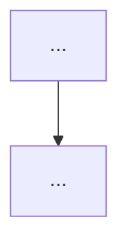

# Nova spec

Cria um doc de especificação seguindo o **formato consistente** já usado nas specs do SIAFIC (ex.: [transversais/](../../../docs/transversais/)).

## Passos

1. **Decidir o local e o número:**
   - Requisito **transversal legal** (assinatura, PNCP, etc.) → `docs/transversais/NN-<slug>.md` (próximo NN da pasta).
   - Domínio/anexo do núcleo → `docs/NN-<slug>.md` (próximo NN top-level).
   - Sub-doc técnico → dentro de `docs/arquitetura-tecnica/`.
2. **Criar o arquivo** com o esqueleto abaixo e preencher o que já se sabe (deixe `TODO` no que faltar; não invente base legal — marque "revalidar na fonte oficial").
3. **Ligar ao índice** [docs/README.md](../../../docs/README.md): adicionar no grupo temático certo.
4. **Ajustar a navegação** dos vizinhos (rodapé ← anterior · Índice · próximo →) se entrar numa sequência.

## Esqueleto

O bloco abaixo usa cercas `~~~` para conter as cercas ```` ``` ```` internas — ao criar o doc, use ```` ``` ```` normalmente.

~~~markdown
# <Título>   (ou "Transversal · <Nome>")

[← Índice](<caminho-relativo-para-README>) · <links de contexto>

> <resumo de 1–2 linhas: o que é e a decisão-chave de produto>

## O que é e base legal

<normas e artigos; marque "revalidar na fonte oficial" onde incerto>

## O que PRECISO implementar

<lista objetiva e acionável>

## O que NÃO preciso implementar (fora de escopo / delegável)

<o que é de terceiro, do ente, ou de outro módulo>

## Como integrar (build × integrate)

<o que construir vs. reutilizar/integrar>

## Fluxo



## Faseamento

| Fase | Entrega |
| --- | --- |
| **F0** | ... |
| **F1** | ... |
| **F2** | ... |

## Fontes

- <fontes oficiais>

---

[navegação de rodapé]
~~~

## Convenções (obrigatórias)

- **H1 na primeira linha**; back-link logo abaixo; rodapé de navegação no fim.
- Tabelas com separador `| --- |`; rótulos de **Mermaid em ASCII sem acento**; blocos Mermaid balanceados.
- Marcações `[OBRIGATÓRIO]` (piso legal) e `[PRODUTO]` (diferencial) onde couber.
- Faseamento coerente com a [tabela-mestre](../../../docs/11-plataforma-transversal.md) e o [roadmap](../../../docs/07-roadmap.md).
- Ao terminar, passe o [guardião](../guardiao/SKILL.md) para checar convenções e links.
