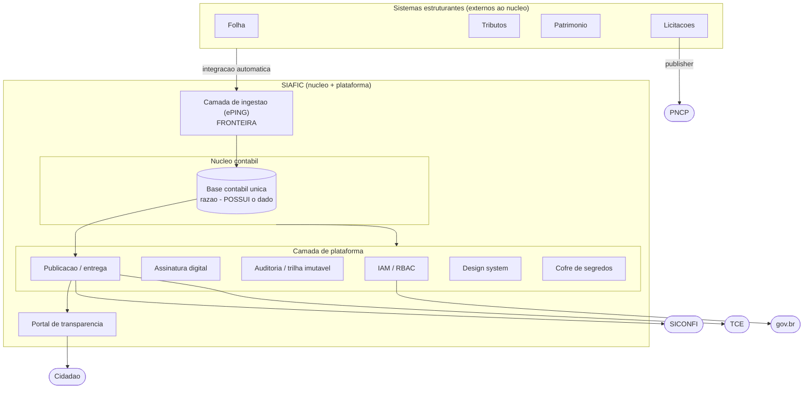

# Arquitetura conceitual

[← Índice](./README.md)

Duas propriedades estruturais impostas **por design**, não por procedimento:

- **Único** — o SIAFIC é único **por ente federativo**: uma só base abrange Executivo, Legislativo (Câmara), autarquias, fundações e fundos, com consolidação dos demais Poderes/órgãos (Ministério Público, Defensoria, TCE) conforme o caso — Decreto 10.540/2020, art. 3º. Câmara ou autarquia operando em sistema separado é hipótese clássica de reprovação no controle externo.
- **Integrado** — orçamento, finanças e contabilidade sobre a mesma base; comunicação com sistemas estruturantes por integração automática, sem intervenção humana.

> **Decisão de arquitetura central:** base contábil única como fonte da verdade. Todo fato entra uma vez; dela derivam-se, sem duplicar dado, a escrituração por partidas dobradas, a publicação na transparência e os extratos para a consolidação nacional.

O isolamento entre entes desta operação multi-ente condiciona diretamente o [fluxo 6 (acesso)](./04-fluxos.md), onde o escopo de ente é validado a cada requisição.

> **Decisão de tenancy:** a unicidade *intra-ente* (art. 3º) convive com operação SaaS *multi-ente*. Definir a estratégia de isolamento entre entes (DB-por-ente, schema-por-ente ou tenant_id com RLS deny-by-default). A escolha condiciona: escopo de ente embutido em todo token/sessão do RBAC; segregação e restauração de backup por ente; store da trilha imutável isolável por ente; e a fronteira de acesso privilegiado. Se schema-compartilhado+tenant_id, exigir RLS deny-by-default com teste de vazamento cross-tenant que falha o build.

Os desdobramentos desta arquitetura estão detalhados em [Fluxos do sistema](./04-fluxos.md).

## Visão de componentes

A **fronteira** entre o núcleo e os sistemas estruturantes externos é atravessada apenas pela camada de ingestão (ePING): estruturantes alimentam a base por integração automática, nunca escrevem diretamente no razão.

## Propriedade de dados e fronteiras

| Dado | Dono | Como chega ao núcleo |
| --- | --- | --- |
| Razão contábil | Núcleo (base única) | Origem — POSSUI o dado |
| Folha | Módulo folha (estruturante) | Integração via ePING |
| Tributos | Módulo tributos (estruturante) | Integração via ePING |
| Patrimônio | Módulo patrimônio (estruturante) | Integração via ePING |
| Licitações | Módulo licitações (estruturante) | Integração via ePING |
| Publisher PNCP | Módulo licitações | Publica a partir do estruturante |

O razão contábil pertence ao núcleo; folha, tributos, patrimônio e licitações são donos dos seus próprios dados e apenas **alimentam** a base por integração, sem posse do razão. O publisher PNCP pertence ao módulo de licitações, não ao núcleo.

Decisões detalhadas: [Plataforma transversal](./11-plataforma-transversal.md) · [Modelo de dados](./10-modelo-dados.md) · [Fluxos do sistema](./04-fluxos.md).

---

[← Base legal](./02-base-legal.md) · [Índice](./README.md) · [Fluxos do sistema →](./04-fluxos.md)
