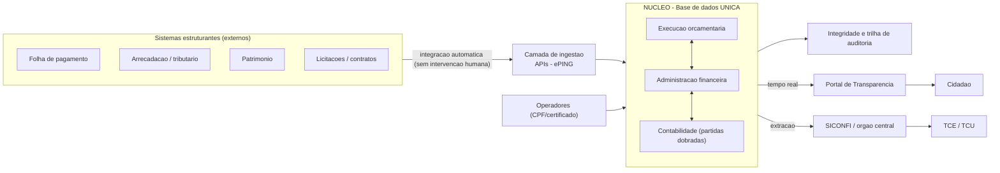
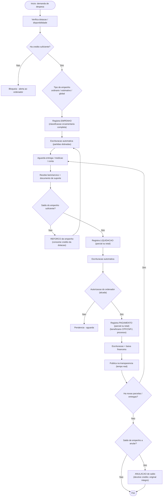
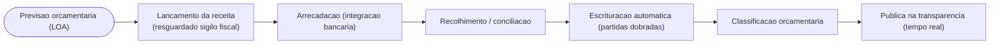
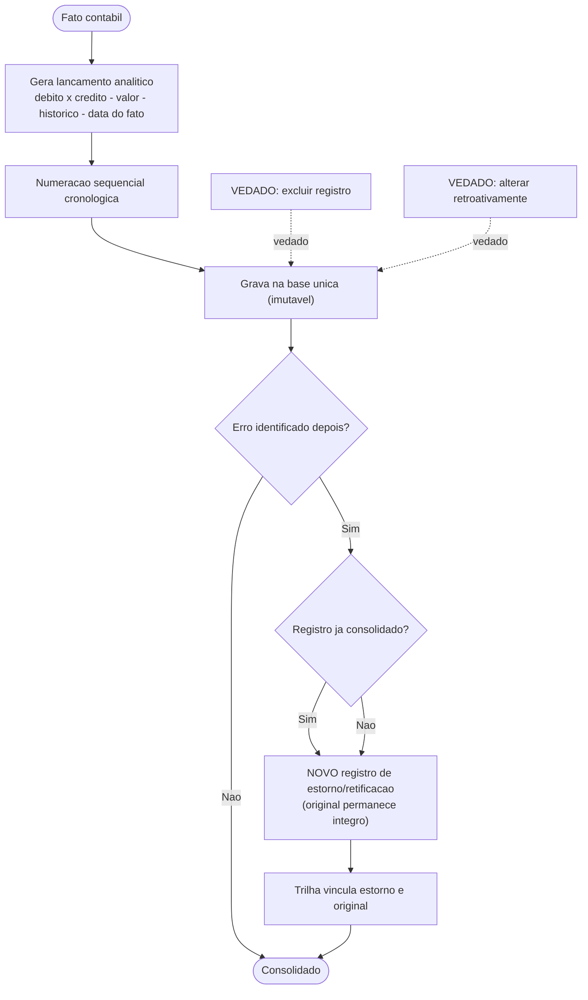
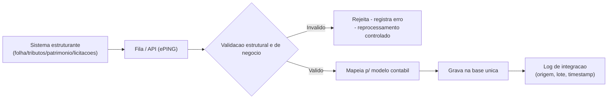
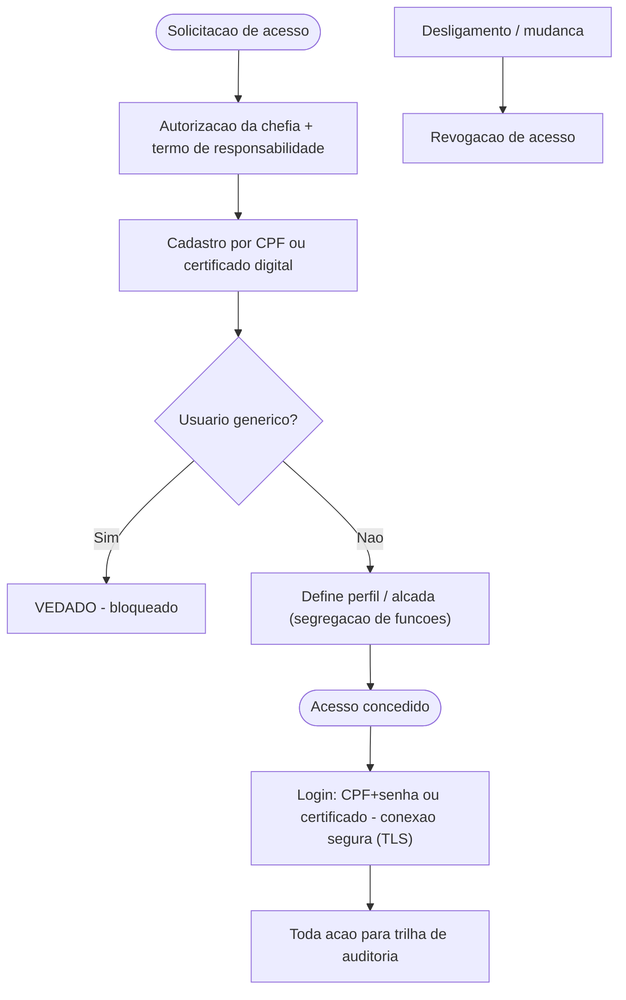
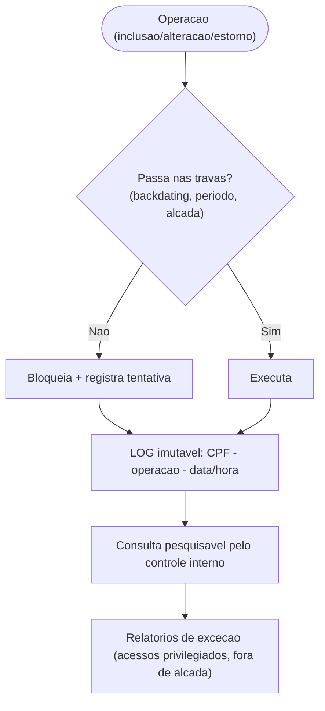
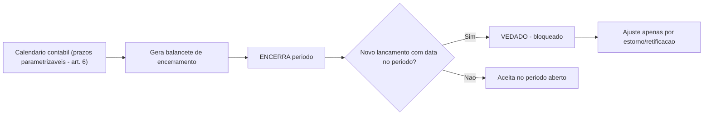
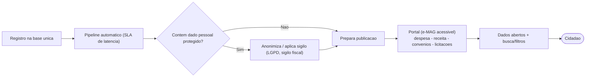
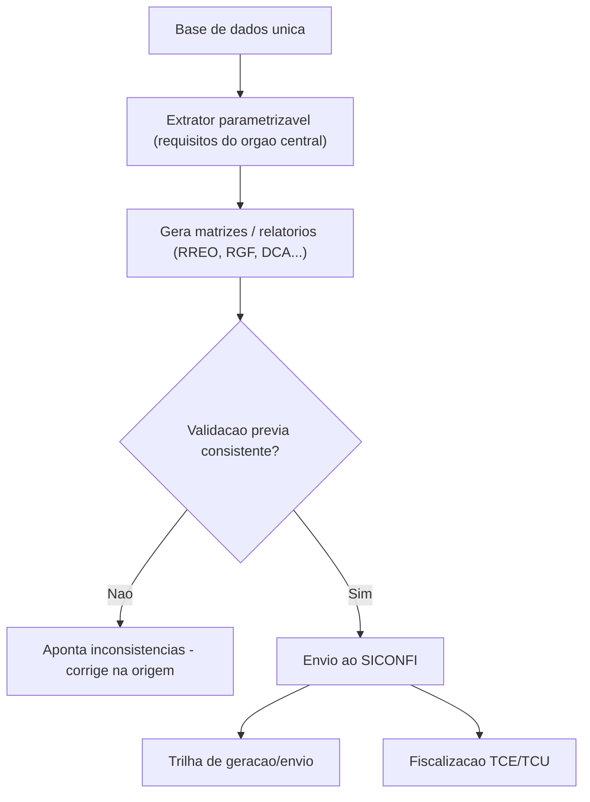

# Fluxos do sistema

[← Índice](./README.md)

Os diagramas abaixo (Mermaid) renderizam automaticamente no GitHub/GitLab.

- [1. Visão macro](#1-visão-macro)
- [2. Execução da despesa](#2-execução-da-despesa)
- [3. Execução da receita](#3-execução-da-receita)
- [4. Escrituração e correção por estorno](#4-escrituração-e-correção-por-estorno)
- [5. Integração com estruturantes](#5-integração-com-sistemas-estruturantes)
- [6. Acesso e autenticação](#6-acesso-e-autenticação)
- [7. Trilha de auditoria e vedações](#7-trilha-de-auditoria-e-vedações)
- [8. Fechamento de período](#8-fechamento-de-período)
- [9. Transparência em tempo real](#9-transparência-em-tempo-real)
- [10. Consolidação nacional (SICONFI)](#10-consolidação-nacional-siconfi)

## 1. Visão macro

Um fato entra uma única vez; da base única derivam escrituração, transparência e consolidação — sem duplicar dado.

**Decisão:** base contábil única como fonte da verdade — elimina a dupla escrituração *por construção*. `[OBRIGATÓRIO]`

## 2. Execução da despesa

Empenho → liquidação → pagamento (**Lei nº 4.320/1964**). Um **empenho** pode ter **N liquidações** e cada liquidação **N pagamentos** (empenho estimativo/global e parcelamento). Cada estágio gera escrituração automática por partidas dobradas na mesma base.

**Cardinalidade:** `1 dotação → N empenhos` · `1 empenho → N liquidações` · `1 liquidação → N pagamentos`.

**Travas:** `data de competência segue o fato gerador (Lei 4.320 art. 35), podendo ser retroativa dentro do período aberto; data-hora de registro é o relógio do servidor, imutável (base da trilha); vedado registrar/alterar em período encerrado e vedado alterar o timestamp de registro` · `documento de suporte obrigatório na liquidação` · `beneficiário exigido no pagamento; folha é dispensada de beneficiário linha-a-linha apenas no gate de pagamento consolidado, mas a remuneração individualizada por servidor é exposta na transparência (STF Tema 483)` · `empenho + reforços ≤ crédito da dotação (art. 59)`.

Detalhamento das entidades no [modelo de dados](./10-modelo-dados.md).

## 3. Execução da receita

Previsão → lançamento → arrecadação → recolhimento, com sigilo fiscal preservado na publicação.

**Travas:** `dado sob sigilo fiscal não é exposto individualmente na transparência` · `acesso interno a receita identificada por contribuinte restrito a perfil/escopo específico por necessidade-de-saber, com a leitura registrada na trilha (CTN art. 198 alcança acesso interno, publicação e exportação)`.

## 4. Escrituração e correção por estorno

Erro não se apaga: corrige-se por novo registro, preservando o original íntegro no histórico.

**Vedações:** `exclusão de registro consolidado` · `alteração retroativa` · `refazer/reprocessar lançamento`.

## 5. Integração com sistemas estruturantes

Comunicação automática, sem redigitação — a base do SIAFIC permanece única.

**Princípio:** `sem intervenção humana` na comunicação entre sistemas · `[PRODUTO]` monitoramento e reprocessamento de lotes.

**Segurança e integridade da ingestão (serviço de plataforma):** autenticação mútua (mTLS) e/ou token de serviço por origem, allowlist de origens, verificação de assinatura/HMAC do payload ANTES de mapear, e chave de idempotência (origem + tipo + id_evento_externo / hash do lote) com deduplicação exactly-once (inbox) para impedir dupla postagem no razão em reenvio legítimo. Rejeitar por falha de origem/assinatura, não só por invalidez de negócio. A interface é definida agora; a implementação acompanha os conectores. Este é o mecanismo que torna executável a Regra 1 (proibida dupla escrituração).

## 6. Acesso e autenticação

Identidade individual obrigatória; usuários genéricos são vedados.

**Travas:** `vedado usuário genérico` · `criptografia em trânsito` · `acesso à base restrito a administradores nominais` · MFA obrigatório para perfis que movimentam recurso (ordenador de despesa, tesouraria/pagamento, administradores de plataforma/banco e acessos privilegiados), aceitando certificado ICP-Brasil ou gov.br Prata/Ouro como fator forte · política de senha forte com hashing moderno e salt (Argon2id/bcrypt/scrypt), limitação de taxa e bloqueio progressivo por conta/IP, timeout de sessão · desprovisionamento com SLA (idealmente automático via evento de RH/folha quando disponível; enquanto não, por termo de desligamento) e recertificação periódica de perfis/alçadas, com relatório de contas órfãs e privilégios sem uso. Registrar tentativas de login falhas na trilha (fluxo 7).

## 7. Trilha de auditoria e vedações

Toda operação é atribuível a uma pessoa e a um instante; tentativas indevidas são bloqueadas e registradas.

`[OBRIGATÓRIO]` log de autor/ação/timestamp · `[PRODUTO]` relatórios de exceção proativos.

A trilha registra também eventos de **leitura/consulta e exportação** de dados pessoais e sob sigilo (quem, o quê, finalidade, quando, volume), modelados como classe de evento distinta da escrita, gravados no mesmo store imutável segregado e alimentando os relatórios de acesso anômalo. No F0, cobrir ao menos dado sob sigilo fiscal e folha/remuneração; ampliar à demais PII em fase posterior.

## 8. Fechamento de período

Após o encerramento, o sistema impede novos registros com data anterior — correções só por estorno no período aberto.

**Nota:** os prazos (art. 6º) são parametrizáveis e devem seguir a redação vigente do decreto.

## 9. Transparência em tempo real

Do registro à publicação até o 1º dia útil subsequente, com acessibilidade e proteção de dados.

**SLA:** `publicação ≤ 1º dia útil subsequente` · `[OBRIGATÓRIO]` exportação em formato aberto legível por máquina (CSV/JSON) dos dados publicados (LAI art. 8º, §3º; Lei 14.129/2021) · `[PRODUTO]` API pública rica, download de bases completas, dicionário de dados avançado, painéis.

## 10. Consolidação nacional (SICONFI)

Extração da mesma base para consolidação nacional e controle externo, com validação prévia.

`[OBRIGATÓRIO]` extração da mesma base · `[PRODUTO]` validação prévia e trilha de envio · `[OBRIGATÓRIO]` calendário legal parametrizável com alertas de vencimento: RREO até 30 dias após cada bimestre (LRF art. 52); RGF até 30 dias após cada quadrimestre — ou semestre para município < 50 mil hab. (LRF art. 55, §2º c/c art. 63); MSC com submissão **mensal** ao SICONFI; DCA anual (prazo STN). O atraso aciona a sanção do art. 23, §3º, I (via art. 73-C).

---

[← Arquitetura](./03-arquitetura.md) · [Índice](./README.md) · [Regras de negócio →](./05-regras-de-negocio.md)
