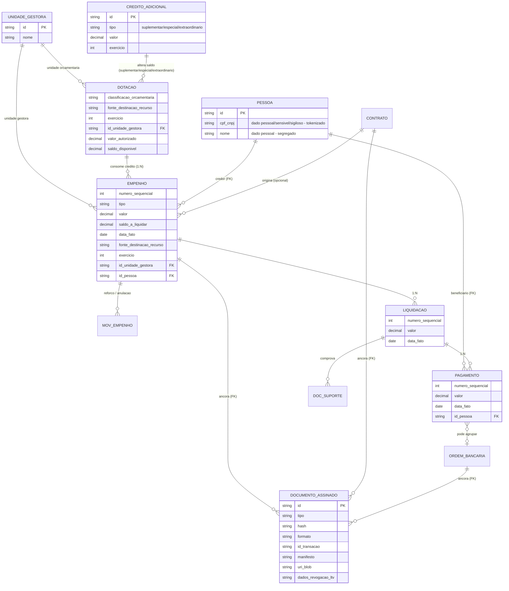
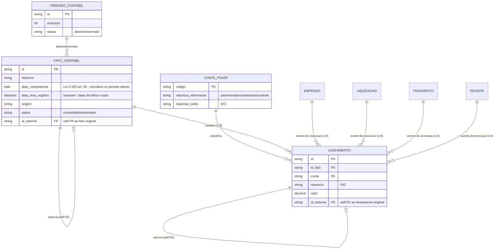
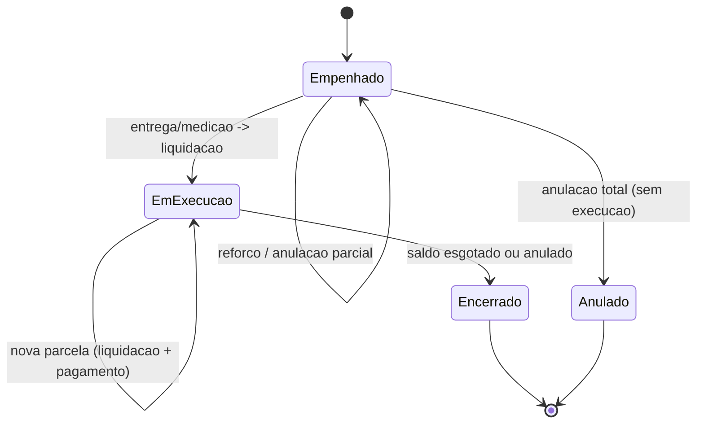

# Modelo de dados — ciclo da despesa (anexo)

[← Índice](./README.md)

> **Escopo:** este anexo detalha as entidades da **execução da despesa** (empenho, liquidação, pagamento) e suas cardinalidades, conforme a **Lei nº 4.320/1964**. O **razão contábil de dupla entrada é o núcleo** do modelo (ver [Razão contábil (núcleo)](#razão-contábil-núcleo)) — a execução da despesa é escriturada como fatos e lançamentos nesse razão, não como domínio lateral. Demais domínios (receita, patrimônio, integrações) serão acrescentados em versões futuras. Complementa o [fluxo 2](./04-fluxos.md#2-execução-da-despesa) e as [regras de negócio](./05-regras-de-negocio.md).

## Diagrama de entidades

> **Nota (dado pessoal):** os identificadores pessoais (CPF/CNPJ, nome, endereço, dados bancários) vivem **segregados/tokenizados** de modo que o lançamento imutável referencie a **PESSOA por chave**. Isso permite anonimização/eliminação ao fim do prazo de retenção **sem violar a integridade do registro contábil** — valor, classificação e vínculo permanecem preservados. Usuário, perfil, alçada e trilha são modelados na [camada de plataforma](./11-plataforma-transversal.md), não neste anexo.
>
> **Nota (documento assinado):** a correção de um documento assinado segue **estorno + novo documento assinado**, preservando o original íntegro (coerente com as [regras 3 e 4](./05-regras-de-negocio.md)). O repositório de documentos (GED/object store) é componente de infraestrutura declarado na [plataforma](./11-plataforma-transversal.md), cifrado em repouso e coberto pelo backup seguro.

## Razão contábil (núcleo)

> Implementação em DDL (PostgreSQL, com as travas de partidas dobradas, imutabilidade, período e RLS): **[schema do razão](./arquitetura-tecnica/razao-contabil-schema.md)**. Design do domínio/aplicação (agregado, invariante Σ=Σ na aplicação, numeração gapless, estorno, saldo derivado): **[motor de partidas dobradas](./arquitetura-tecnica/motor-razao-partidas-dobradas.md)**.

O coração do sistema é o **razão contábil de dupla entrada**: todo evento de execução (empenho, liquidação, pagamento, receita) é escriturado como um **fato contábil** que gera **lançamentos/partidas** balanceados (`soma(D) = soma(C)`) sobre contas do PCASP. A obrigatoriedade da escrituração por partidas dobradas está ancorada na **LRF (LC 101/2000) art. 50, §2º**, na **Lei 4.320/1964 art. 85** e na **Portaria STN vigente (MCASP/PCASP)**.

**Invariante do razão:** para cada `FATO_CONTABIL`, `soma(valor onde natureza=D) = soma(valor onde natureza=C)`.

**Duas datas por fato:** o `FATO_CONTABIL` carrega **`data_competencia`** (Lei 4.320 art. 35 — segue o fato gerador e pode ser retroativa enquanto o período estiver aberto) e **`data_hora_registro`** (imutável, base da trilha de auditoria e do encadeamento de hash). O **estorno** é modelado como novo `FATO_CONTABIL`/`LANCAMENTO` com self-FK `estorna` referenciando o registro original, que permanece íntegro.

## Cardinalidades e base legal

| Relação | Cardinalidade | Base legal (Lei 4.320/1964) |
| --- | --- | --- |
| Dotação → Empenho | 1 : N | art. 59 (limite é o crédito, não a quantidade) |
| Empenho → Liquidação | 1 : N | art. 60 §2º/§3º (estimativo/global) + art. 63 |
| Liquidação → Pagamento | 1 : N | arts. 62–65 (pagamento pode ser parcial) |
| Empenho → Mov. de empenho | 1 : N | reforço e anulação (total/parcial) |
| Liquidação → Doc. de suporte | 1 : N | art. 63 §2º (contrato, nota de empenho, comprovantes) |
| Pagamento → Ordem bancária | N : 1 (opcional) | OB agrupadora — vários pagamentos num só documento financeiro |

> **Restrição inversa:** a liquidação tem por base **uma** nota de empenho (art. 63, §2º, II). Logo a relação é **1 empenho → N liquidações**, e **não** N:N — uma nota fiscal que envolva dois empenhos gera **duas liquidações**.

## Tipos de empenho (art. 60)

| Tipo | Quando usar | Cardinalidade típica |
| --- | --- | --- |
| **Ordinário** | Valor certo, pagamento de uma vez | 1 empenho : 1 liquidação : 1 pagamento |
| **Estimativo** (§2º) | Montante não determinável (água, luz, telefone) | 1 empenho : N liquidações |
| **Global** (§3º) | Despesa contratual sujeita a parcelamento | 1 empenho : N liquidações : N pagamentos |

## Ciclo de vida do empenho

## Travas de integridade

Impostas pelo sistema (ver [regras de negócio](./05-regras-de-negocio.md)):

- **Empenho ≤ crédito** — `valor do empenho + reforços − anulações ≤ saldo vigente da dotação` (art. 59); reforço consome crédito, anulação devolve. O `saldo_disponivel` vigente é `dotação inicial ± créditos adicionais` (suplementar/especial/extraordinário — Lei 4.320 arts. 40–46, CF art. 167).
- **Data de competência segue o fato gerador** — `data_competencia` acompanha o fato gerador (Lei 4.320 art. 35) e pode ser retroativa **enquanto o período estiver aberto**; a `data_hora_registro` é imutável; é vedado registrar ou alterar em período encerrado (coerente com o [fluxo 2](./04-fluxos.md#2-execução-da-despesa) e a [Regra 2](./05-regras-de-negocio.md); ver também [fluxo 7](./04-fluxos.md#7-trilha-de-auditoria-e-vedações)).
- **Documento de suporte na liquidação** — obrigatório (art. 63, §2º).
- **Beneficiário no pagamento** — CPF/CNPJ exigido (exceto folha).
- **Pagamento ≤ liquidado** e **liquidação ≤ empenhado** — saldos nunca negativos.
- **Correção só por movimento novo** — reforço/anulação/estorno; registro original permanece íntegro ([fluxo 4](./04-fluxos.md#4-escrituração-e-correção-por-estorno)).

---

[← Referências](./09-referencias.md) · [Índice](./README.md) · [Plataforma e transversais →](./11-plataforma-transversal.md)
