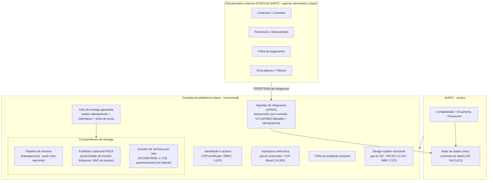

# Plataforma e requisitos transversais

[← Índice](./README.md)

> Este produto é o **módulo base** sobre o qual os demais sistemas de gestão pública se apoiam. Por isso, requisitos que valem para *qualquer* módulo — identidade, assinatura, auditoria, publicação, acessibilidade — devem ser resolvidos **aqui, uma vez, como serviços de plataforma**, e herdados pelos módulos. Resolvê-los por módulo gera retrabalho e reprovação no controle externo.

## Por que decidir isso agora

Porque é o módulo base, três consequências:

1. **Herança** — um serviço de identidade, assinatura ou auditoria feito na plataforma é reaproveitado por licitações, patrimônio, folha etc. Feito por módulo, multiplica custo e diverge.
2. **Conformidade por construção** — LGPD, trilha e tempo real são **propriedades da plataforma**, não features opcionais. O controle externo reprova o **conjunto**, não o módulo isolado.
3. **Contratos estáveis** — mesmo o que não entra no MVP precisa ter a **interface definida agora** (ex.: assinatura, publicação PNCP), para os módulos futuros dependerem de um contrato e não de um retrofit.

> **Regra prática:** definir a **interface** de todos os serviços transversais agora; **implementar no F0/F1** os que o núcleo já usa (identidade, auditoria, transparência, assinatura de empenho); **habilitar o resto** quando o módulo correspondente chegar.
>
> **Herança sem base compartilhada:** os estruturantes herdam **IAM, assinatura, auditoria, publicação e design system** — mas **NÃO compartilham a base contábil**. O **resultado financeiro consolidado** da folha/tributos entra no razão; o **detalhe individual permanece no estruturante** (e a remuneração individualizada é publicada na transparência, **Tema 483**).
>
> **Front-end (decisão de plataforma):** adota-se o **Design System gov.br** como base de tokens e componentes acessíveis (piso **WCAG 2.2 AA / eMAG / NBR 17225**), sobre o qual se constrói uma camada de tematização/UX própria para preservar o diferencial de UX. O piso legal é a **conformidade de acessibilidade** (LBI art. 63, WCAG/eMAG), **não o DS em si** — o DS é meio, não obrigação. Referenciada pela spec de acessibilidade.

## Camada de plataforma

## Requisitos transversais → serviços de plataforma

Cada requisito tem uma **spec de produto detalhada** em [`transversais/`](./transversais/) (o que é, o que preciso/não preciso implementar, como integrar, fluxo e faseamento):

| Norma transversal | Serviço de plataforma | Spec | Status |
| --- | --- | --- | --- |
| **SIAFIC** (Decreto 10.540) | É o próprio núcleo | — | ✅ toda a doc |
| **Entrega garantida** (infra transversal) | **Outbox idempotente + retentativa + trilha de envio** — capacidade compartilhada, **não específica do PNCP** | — | 🟡 **F0** interface + implementação mínima para o 1º consumidor (transparência) |
| **Transparência** (LC 131 · Dec. 7.185 · LAI) | Consumidor de entrega: **pipeline de eventos** (push near-real-time) → portal + dados abertos | [📄 03](./transversais/03-transparencia.md) | 🟡 build de núcleo ([Fluxo 9](./04-fluxos.md#9-transparência-em-tempo-real)) |
| **PNCP** (14.133, art. 174) | Consumidor de entrega: **publisher outbound** — **de propriedade do módulo licitações, não do núcleo** | [📄 02](./transversais/02-pncp.md) | 🟡 núcleo: gate de eficácia (art. 94) |
| **SICONFI/MSC · TCE** | Consumidor de entrega: **extrator de remessa em lote** (parametrizável por leiaute) | — | 🟡 remessa/lote |
| **LGPD** (13.709) | IAM/RBAC, mascaramento, base legal, retenção, trilha | [📄 04](./transversais/04-lgpd.md) | 🟡 parcial — falta governança explícita |
| **Assinatura eletrônica** (14.063 · MP 2.200-2) | Serviço de assinatura (gov.br avançada + ICP-Brasil qualificada) | [📄 01](./transversais/01-assinatura-eletronica.md) | 📄 especificado — **F0** via API gov.br |
| **Acessibilidade** (LBI · **WCAG 2.2 AA**) | Design system acessível (portal **e** back-office) | [📄 05](./transversais/05-acessibilidade.md) | 🟡 alvo definido; só o portal detalhado |

### Cofre/gestão de segredos

Serviço **único** de plataforma, não resolvido ponto a ponto por integração:

- Padrão único (**secrets manager / HSM-backed**); nada de segredo em código, repositório ou config.
- **Rotação** periódica e sob incidente, com trilha de uso/rotação.
- **Tokens de curta duração** com renovação automática.
- **Contas de serviço** com privilégio mínimo e escopo restrito por integração (gov.br sign, PNCP publish, banco, SICONFI, TCE).

> As specs [02-pncp](./transversais/02-pncp.md), [01-assinatura](./transversais/01-assinatura-eletronica.md) e [04-lgpd](./transversais/04-lgpd.md) **referenciam este padrão** em vez de descrever um "cofre" pontual.

## Contratos/Interfaces dos serviços de plataforma

Piso do desacoplamento que o documento defende (**definir a interface agora**). Assinatura mínima estável de cada serviço consumido pelos módulos — operações, entradas/saídas, erros e eventos:

| Serviço | Operações (assinatura mínima) | Erros / eventos |
| --- | --- | --- |
| **Identidade/RBAC** | `autenticar(credencial) -> sessao`; `autorizar(sessao, recurso, acao) -> bool`; escopo por **ente/órgão**; `mfa(desafio)` | `nao_autenticado`, `sem_permissao`, `mfa_requerido`; evento `login`/`negado` |
| **Assinatura** | `sign(doc, nivel, signatarios) -> {pdfAssinado, manifesto, hash, idTransacao}`; `verificar(doc) -> valido` | `certificado_invalido`, `nivel_insuficiente`; evento `assinado` |
| **Auditoria** | `append(evento)` **imutável**; classes **escrita** e **leitura**; `consultar(filtro) -> eventos` | `append` nunca falha silenciosamente; evento é o próprio registro |
| **Publicação/Entrega** | `enqueue(mensagem, chaveIdempotencia) -> idEntrega` **idempotente**; `status(idEntrega)` com rastreio de entrega | `duplicado` (idempotente), `retentando`, `entregue`, `falha_permanente` |
| **Mascaramento** | `mask(campo, contexto, audiencia) -> valorMascarado` | `sem_base_legal`; evento `acesso_dado_pessoal` |
| **Ingestão** | `receber(mensagem, origem)` → verifica **origem/assinatura** + **deduplica** por chave de idempotência | `origem_nao_confiavel`, `assinatura_invalida`, `duplicado` |
| **Cofre de segredos** | `obter(conta, segredo) -> valor`; `rotacionar(segredo)` | `sem_escopo`, `expirado`; evento `uso`/`rotacao` |

> **Materializado em código (RAZ-8, [ADR-0014](./arquitetura-tecnica/adr/0014-contratos-plataforma-ports.md)):** os sete contratos acima são **ports** em `plataforma-domain` (`br.contabil.plataforma.domain.<contrato>`) — POJO puro, fiscalizado pelos guardrails. Os erros têm **código estável** (`ErroContrato#codigo`, ex. `nao_autenticado`), travado por teste de contrato. Auditoria é segregada em escrita/leitura; ingestão e entrega compartilham `ChaveIdempotencia`. As **implementações** (adapters) vêm à parte: identidade (RAZ-5), auditoria (RAZ-6), entrega/outbox (RAZ-9), assinatura (RAZ-11), mascaramento (RAZ-12).

## Escopo do produto: núcleo × estruturantes

Mapa das categorias de edital (padrão CE) contra o nosso produto:

| Categoria (edital) | Papel legal | No nosso produto |
| --- | --- | --- |
| B.1 Contabilidade (PCASP/MCASP/DCASP) | Núcleo SIAFIC | ✅ núcleo |
| B.2a Carga/importação da LOA aprovada + créditos adicionais | Núcleo SIAFIC (habilitador da execução) | **F1 (MVP)** |
| B.2b Elaboração de PPA/LDO/LOA | Núcleo SIAFIC (planejamento) | 🟡 [Roadmap F4](./07-roadmap.md) |
| B.3 Execução financeira / tesouraria | Núcleo SIAFIC | ✅ [Fluxo 2](./04-fluxos.md#2-execução-da-despesa) — falta restos a pagar / fluxo de caixa |
| B.4 Prestação de contas (SICONFI/MSC/TCE) | Núcleo SIAFIC (saída) | 🟡 [Fluxo 10](./04-fluxos.md#10-consolidação-nacional-siconfi) — falta MSC/Portaria 642 e remessas TCE |
| B.5 SIAFIC | Requisito estruturante = arquitetura do núcleo | ✅ toda a doc |
| Licitações, Patrimônio, Almoxarifado, Folha, Tributos | **Estruturantes** (integram, fora do SIAFIC legal) | Integram via [Fluxo 5](./04-fluxos.md#5-integração-com-sistemas-estruturantes); módulos comerciais à parte |

> **Orçamento no MVP:** não há **execução da despesa** (Fluxo 2, verificação de crédito) sem a **LOA e os créditos adicionais carregados** (**CF art. 167**). Por isso a **carga da LOA (B.2a) é F1/MVP**, enquanto a **elaboração de PPA/LDO/LOA (B.2b) fica no F4**.
>
> **Consequência comercial:** o mercado compra o *pacote único*, mas o **núcleo é o critério de reprovação** do controle. Vender o núcleo conforme + estruturantes plugáveis é a estratégia coerente com [mercado.md](./08-mercado.md).

## Lacunas prioritárias e faseamento

> **Taxonomia única de fases:** para evitar ambiguidade, as fases internas de cada spec transversal (hoje rotuladas F0/F1/F2) são fases de **MATURIDADE** do serviço e devem ser mapeadas à fase **GLOBAL** do roadmap por esta tabela-mestre, que é a **fonte única de verdade**.

| Serviço transversal | Maturidade (M0/M1/M2) | Fase global do roadmap |
| --- | --- | --- |
| Identidade / RBAC | M0 | F0 |
| Assinatura | M0 (interface + gov.br) / M1 (ICP-Brasil) | F0 / F1 |
| Auditoria | M0 | F0 |
| Transparência | M0 | F0 |
| LGPD | M1 | F1 |
| PNCP | M0 (nº de controle) / M1–M2 (gate bloqueante) | F0 / F1–F2 |
| Acessibilidade | M0 (portal) / M1 (back-office) | F0 / F1 |
| Prestação de contas (SICONFI/MSC · TCE) | M1 | MVP/go-live |

| Lacuna | Onde entra | Fase sugerida |
| --- | --- | --- |
| **Assinatura eletrônica** (empenho/contrato) | Serviço de plataforma | **F0** interface + gov.br avançada; **F1** qualificada ICP-Brasil e assinatura de empenho/contrato (acompanha a execução) |
| **Governança LGPD** (base legal, retenção, direitos do titular) | Plataforma + transparência | **F1** |
| **eMAG no back-office** (não só portal) | Design system | **F1** |
| **MSC / Portaria 642** e remessas **TCE-CE/TCM-CE** | Consolidação (prestação de contas) | **MVP/go-live** (bloqueante por cliente) — um MVP de conformidade sem prestação de contas não sobrevive ao primeiro ciclo de controle externo |
| **Restos a pagar** (Lei 4.320 arts. 36–37) e trava de suficiência de caixa (LRF art. 42, fim de mandato) `[OBRIGATÓRIO]` | Execução financeira | **F1 (MVP)** |
| **Publicação no PNCP** (art. 174) + gate de eficácia (art. 94) | Motor de publicação + módulo licitações | **F0** campo nº de controle PNCP + aviso (não bloqueio); **F1/F2** gate bloqueante condicional a despesa vinculada a contrato sujeito ao PNCP, com reconciliação/integração de licitações |
| **Migração/implantação do ente** (saldos, restos a pagar, séries, de-para PCASP) → [12-migracao](./12-migracao.md) | Onboarding | **F1 — bloqueante de go-live**; após a modelagem do razão |
| **NFR e operação** + **[piso de segurança F0](./13-nfr-e-operacao.md#piso-de-segurança-f0)** (disponibilidade, RPO/RTO, DR/BCP, backup imutável) → [13-nfr-e-operacao](./13-nfr-e-operacao.md) | Plataforma / operação | **F0** piso inegociável; **F1/F2** escalona *enterprise* |

---

[← Modelo de dados](./10-modelo-dados.md) · [Índice](./README.md)
