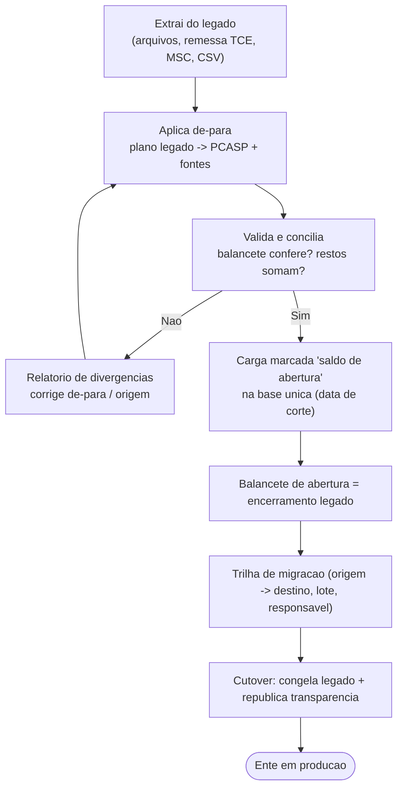

# Migração e implantação (onboarding do ente)

[← Índice](./README.md)

> **Bloqueante de go-live.** A migração é a **barreira nº 1** da tese de substituição de incumbente ([mercado](./08-mercado.md)): o ente só troca de sistema se os saldos, restos a pagar e a série histórica vierem íntegros e conciliados. Sequenciada **após** a modelagem do razão ([modelo de dados](./10-modelo-dados.md)).

## Por que é crítico

- O município/estado **já opera** um SIAFIC (obrigatório desde 2023). Trocar = **migrar dados vivos**, não começar do zero.
- O **balancete de abertura** do novo sistema tem de bater com o encerramento do legado — senão o Tribunal de Contas rejeita e o gestor responde.
- Sem migração confiável, não há venda: é o item que **derruba a proposta** na prática, mesmo com o núcleo perfeito.

## Escopo da migração

| Objeto | Conteúdo |
| --- | --- |
| **Saldos de abertura** | Saldos contábeis (patrimonial, orçamentário, controle) por conta PCASP no corte |
| **Restos a pagar** | Processados e não processados, por empenho, com trava do LRF art. 42 |
| **Empenhos/contratos em aberto** | Empenhos com saldo, liquidações/pagamentos pendentes, contratos vigentes (+ nº de controle PNCP quando houver) |
| **Séries históricas** | Exercícios anteriores para transparência e consulta (não sobrescrever) |
| **Mapeamento de plano de contas** | De-para do plano legado → **PCASP** (contas, natureza da informação/saldo) |
| **Cadastros de apoio** | Credores/pessoas, unidades gestoras, fontes/destinação de recursos, dotações |

## O que PRECISO implementar

1. **Extração do legado** — conectores/importadores (arquivos do fornecedor anterior, remessas do TCE, MSC, CSV/planilhas) — sem depender de acesso ao sistema legado em produção.
2. **Motor de de-para (mapeamento)** — plano de contas legado → PCASP, códigos de fonte/recurso, naturezas; versionado e auditável.
3. **Validação e conciliação** — **balancete de abertura confere** (Σdébito = Σcrédito e igual ao encerramento legado); saldos por conta batem; restos a pagar somam; relatório de divergências.
4. **Carga marcada** — os registros migrados entram na base única **rotulados como “saldo de abertura / carga de migração”**, com data de corte, distintos dos fatos correntes.
5. **Trilha de migração** — origem → destino de cada registro (lote, arquivo, timestamp, responsável), imutável e consultável pelo controle interno.
6. **Dry-run e reversibilidade** — simulação em ambiente de homologação, com possibilidade de refazer a carga antes do cutover (nunca depois de consolidado).
7. **Plano de cutover** — data de corte, congelamento do legado, janela de convivência, checklist de aceite (balancete, restos, transparência republicada).
8. **Sigilo na migração** — dados pessoais/sigilosos migrados sob as mesmas regras de [LGPD](./transversais/04-lgpd.md) (cifra, acesso restrito, mascaramento na exposição).

## O que NÃO preciso implementar

- **Manter o sistema legado vivo** — a migração é *one-shot* + convivência curta; não é integração permanente.
- **Migrar o que a lei não exige guardar** — respeitar a política de retenção; não arrastar lixo histórico.
- **Motor de ETL genérico do zero** — reusar ferramentas de ingestão/ETL; o valor está no **de-para PCASP** e na **conciliação**, não no encanamento.
- **Reprocessar/alterar fatos consolidados do legado** — migra-se o **saldo/estado**, preservando o histórico; correções seguem por estorno no novo sistema.

## Fluxo — carga de abertura de um ente

## Dependências e faseamento

- **Depende de:** modelagem do **razão contábil** ([modelo de dados](./10-modelo-dados.md)) e do PCASP — não dá para migrar saldos sem as contas de destino.
- **F1 (go-live):** migração do **ente-piloto** como **bloqueante de go-live** — extração, de-para, conciliação, carga marcada, trilha e cutover.
- **F2+:** industrializar (conectores por fornecedor incumbente, de-para reutilizáveis, migração assistida em escala para novos entes).

## Fontes e ressalvas

- LRF art. 42 (restos a pagar) · Lei 4.320/1964 · PCASP/MCASP (STN) — [base legal](./02-base-legal.md).
- Leiautes de origem variam por fornecedor incumbente e por TCE — tratar como **configuração**, não código.

---

[← Plataforma e transversais](./11-plataforma-transversal.md) · [Índice](./README.md) · [NFR e operação →](./13-nfr-e-operacao.md)
