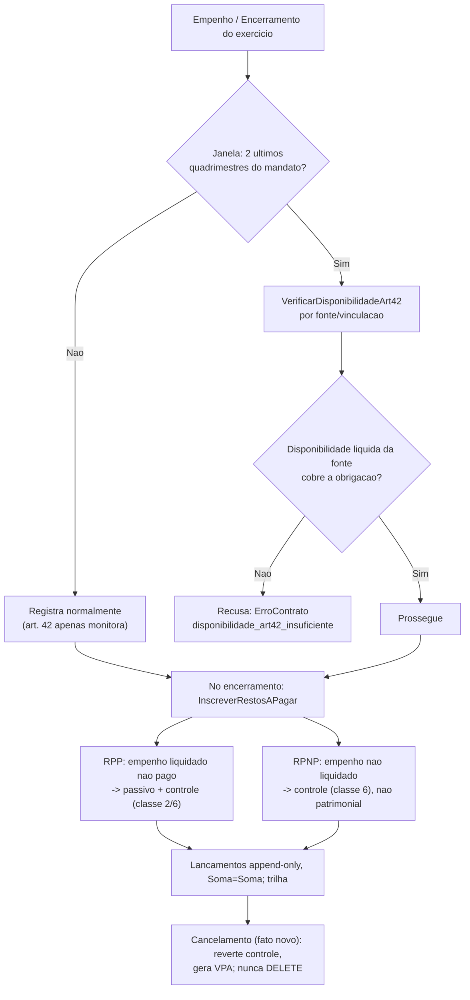

# Restos a pagar e trava de disponibilidade de caixa (LRF art. 42)

[← Índice](./README.md) · [Fechamento contábil](./15-fechamento-contabil.md) · [Prestação de contas](./16-prestacao-de-contas.md) · [Fluxo 2 — execução da despesa](./04-fluxos.md#2-execução-da-despesa)

> **Fase F1.** Inscrição de restos a pagar (processados e não processados) no rito de
> encerramento, cancelamento de RP, o roteiro PCASP das contas de controle, e a **trava do
> art. 42 da LRF** — vedação de contrair obrigação sem disponibilidade de caixa por
> fonte/vinculação nos dois últimos quadrimestres do mandato, materializada como **gate
> transacional** no padrão do [ADR-0023](./arquitetura-tecnica/adr/0023-gate-aprovacao-pagamento-segregacao.md).
> **Depende de [Fechamento contábil](./15-fechamento-contabil.md)** (a inscrição de RP acontece
> no encerramento) e da modelagem de **fonte de recursos** no razão. Os pontos `[REVALIDAR]`
> dependem de confirmação na fonte oficial **MCASP/MDF (edição vigente)** antes de produção.

## O que é / base legal

**Restos a pagar (RP)** são as despesas **empenhadas e não pagas até 31 de dezembro**,
distinguindo-se as **processadas** (empenho já liquidado — direito do credor apurado, obrigação
líquida e certa) das **não processadas** (empenho ainda não liquidado). A inscrição é o ato,
no encerramento do exercício, que carrega essas obrigações para o exercício seguinte. A **trava
do art. 42** impede que o gestor, no fim do mandato, deixe RP sem lastro de caixa por fonte.

- **Lei 4.320/1964** art. 36 — define RP e a distinção processados × não processados; arts. 37
  e 92 — dívida flutuante e sua escrituração.
- **LRF (LC 101/2000) art. 42** — veda ao titular de Poder/órgão, **nos dois últimos
  quadrimestres do mandato**, contrair obrigação de despesa que não possa ser cumprida no
  exercício ou cujas parcelas fiquem para o exercício seguinte **sem suficiente disponibilidade
  de caixa**; o parágrafo único manda considerar os encargos e despesas compromissadas a pagar
  até o fim do exercício.
- **MCASP (STN, edição vigente)** `[REVALIDAR]` — as **contas de controle de RP** (classe 6) e a
  **DDR — Disponibilidade por Destinação de Recursos** (classes 7 e 8), que sustentam o cálculo
  da disponibilidade de caixa **por fonte/vinculação**; o roteiro de **inscrição** e de
  **cancelamento** de RP processados e não processados.
- **MDF — Manual de Demonstrativos Fiscais (STN, edição vigente — 15ª ed. para 2026, Portaria
  STN/MF 2.057/2025, cf. [doc 16](./16-prestacao-de-contas.md))** `[REVALIDAR]` — o Demonstrativo
  dos Restos a Pagar (RREO) e o **Demonstrativo da Disponibilidade de Caixa e dos Restos a Pagar**
  (RGF, base do art. 42). O produto **produz os saldos**; os demonstrativos saem da MSC via a
  frente [prestação de contas](./16-prestacao-de-contas.md).
- **Decreto 93.872/1986** (federal) arts. 67–70 — vigência e cancelamento de RP; para
  estados/municípios a **validade é parametrizável por legislação local** `[REVALIDAR]`.
- **Decreto 10.540/2020** (SIAFIC) — inscrição e controle de RP com integridade e trilha.

## Preciso (escopo F1)

1. **Inscrição de RP no encerramento** — *interface* com o [fechamento](./15-fechamento-contabil.md)
   (chamada pelo `EncerrarExercicio`). Ao encerrar o exercício, apura e inscreve por
   fonte/vinculação e por ano de inscrição (`AI`):
   - **RP Processados (RPP)** — empenhos **liquidados** (Lei 4.320 art. 63) e não pagos: obrigação
     líquida e certa → **passivo financeiro** (patrimonial) + controle.
   - **RP Não Processados (RPNP)** — empenhos **não liquidados** até 31/12: **controle, não
     patrimonial** (o fato gerador/liquidação ainda não ocorreu) — vira passivo só quando liquidado.
   - Tudo por **lançamentos append-only, Σdébito=Σcrédito, atômico** via o motor de razão. **Nunca**
     `UPDATE`/`DELETE`.
2. **Roteiro PCASP das contas de controle** `[REVALIDAR códigos MCASP vigente]`:
   - **RPNP:** transferir o saldo de **Crédito Empenhado a Liquidar** (classe 6.2.x) para **RP Não
     Processados a Liquidar / Inscritos** (classe 6.3.x).
   - **RPP:** reconhecer **RP Processados a Pagar** — passivo (classe 2) + controle (classe 6.3.x).
   - Segregar por **`AI` (ano de inscrição de RP)** — casa com a informação complementar `AI` da
     MSC ([doc 16 §Preciso](./16-prestacao-de-contas.md#preciso-escopo-f1)).
   - **DDR (classes 7/8) no encerramento** (IPC 03/STN rev. 2017 §§90-96) — encerra **apenas a
     disponibilidade utilizada**: `D 8.2.1.1.4.00.00 (DDR Utilizada) / C 7.2.1.1.X.00.00 (Controle da
     Disponibilidade de Recursos)`, **por fonte/destinação** (§91). As disponibilidades **comprometidas
     por empenho** (`8.2.1.1.2`) e **por liquidação** (`8.2.1.1.3`) **não** encerram — acompanham a
     execução dos RP até o pagamento e **transitam para o exercício seguinte**, dando o lastro por fonte
     aos RP inscritos. Na abertura (§96): `D 8.2.1.1.1.01.00 (Recursos Disponíveis para o Exercício) /
     C 8.2.1.1.1.02.00 (Recursos de Exercícios Anteriores)` transpõe o **superávit financeiro por
     fonte** — a base do art. 42 no exercício seguinte.
3. **Cancelamento de RP** — sempre por **fato novo** (estorno/lançamento), nunca deleção:
   - **RPNP:** cancelamento por **prescrição de vigência** (prazo parametrizável por ente) ou por
     inexistência da obrigação — reverte o controle; quando já patrimonial, gera **VPA (variação
     patrimonial aumentativa)** por reversão.
   - **RPP:** cancelamento **excepcional** (obrigação líquida e certa) — rito reforçado
     (`MOVIMENTA_RECURSO` + motivo obrigatório) e trilha; gera VPA.
4. **Trava LRF art. 42 — gate transacional por fonte** (padrão do [ADR-0023](./arquitetura-tecnica/adr/0023-gate-aprovacao-pagamento-segregacao.md)):
   - Calcula **Disponibilidade de Caixa Líquida por fonte/vinculação** = disponibilidade bruta da
     fonte − obrigações financeiras da fonte (RPP, RPNP já liquidados, depósitos/consignações,
     demais obrigações). **Sem compensar entre fontes** — o superávit de uma vinculada não cobre o
     déficit de outra.
   - **Gate *hard* nos dois últimos quadrimestres do mandato:** recusa **contrair obrigação**
     (empenho) — e, no encerramento, **inscrever RP** — que a fonte não lastreie, com o novo erro de
     contrato `disponibilidade_art42_insuficiente` (**nova entrada na taxonomia única `ErroContrato`**,
     não uma segunda taxonomia — mesma regra dos [ADR-0022](./arquitetura-tecnica/adr/0022-lote-pagamento-contrato-api-execucao.md)/[0023](./arquitetura-tecnica/adr/0023-gate-aprovacao-pagamento-segregacao.md)).
   - **Fora da janela:** o cálculo é **informativo/monitor** (alimenta o RREO e alertas), **não
     bloqueia** — o art. 42 só veda no fim de mandato.
   - A **DDR (classes 7/8)** é o mecanismo contábil que torna o cálculo por fonte derivável do razão:
     a disponibilidade líquida por fonte **não é um cálculo avulso** — é o **saldo das contas
     `7.2.1`/`8.2.1`** já mantidas pelo razão pela execução (IPC 03/STN §§90-96), do qual o
     `VerificarDisponibilidadeArt42` deriva diretamente (a `DisponibilidadePorFontePort` recebe as
     contas DDR relevantes e devolve o saldo devedor líquido por fonte, sem compensação entre fontes).
5. **Trilha + RBAC+MFA:** inscrição e cancelamento são `MOVIMENTA_RECURSO` ([ADR-0016](./arquitetura-tecnica/adr/0016-controle-acesso-mfa-movimentacao-recurso.md));
   evento de auditoria dedicado (quem, quando, fonte, valor, motivo no cancelamento).

## Não preciso (agora)

- **Gerar os demonstrativos MDF** em si (RREO Anexo de RP, Demonstrativo de Disponibilidade de
  Caixa e RP do art. 42) — saem da **MSC** na frente [prestação de contas](./16-prestacao-de-contas.md);
  aqui só **produzimos os saldos** por fonte/`AI`.
- **Bloquear pelo art. 42 fora da janela** de fim de mandato — fora dela é só monitor/alerta.
- **Reinscrição / repriorização** avançada de RP entre exercícios além do mínimo do encerramento.
- **Regras locais de prescrição de vigência** de RP não processados — **parametrizáveis** por ente,
  não hard-coded.

## Como integra (código existente)

- **Já existe:** motor de razão (Σ=Σ, append-only), **estorno** (`EstornarFatoContabil`), período
  contábil + rito de encerramento ([doc 15](./15-fechamento-contabil.md): `EncerrarExercicio`
  sugerido), o **padrão de gate transacional** ([ADR-0023](./arquitetura-tecnica/adr/0023-gate-aprovacao-pagamento-segregacao.md):
  pré-condição de estado + `ErroContrato` dedicado), a **taxonomia única `ErroContrato`**, RBAC+MFA
  ([ADR-0016](./arquitetura-tecnica/adr/0016-controle-acesso-mfa-movimentacao-recurso.md)) e a
  auditoria hash-chain.
- **Falta (pré-requisito):** **modelagem de fonte/destinação de recursos (vinculação)** no razão — a
  MSC já a lista como informação complementar `FR` "a modelar" ([doc 16](./16-prestacao-de-contas.md#preciso-escopo-f1));
  sem ela não há cálculo por fonte nem art. 42. Também faltam as **contas de controle de RP e a DDR**
  (classes 6/7/8) no plano de contas, e os casos de uso abaixo.
- **Novos use cases sugeridos** (`application`, POJO — a `infra` faz o wiring/transação):
  - `InscreverRestosAPagar` — chamado pelo `EncerrarExercicio`; particiona RPP × RPNP por fonte/`AI`
    e gera os lançamentos de controle/patrimoniais.
  - `CancelarRestoAPagar` — cancela por fato novo (VPA na reversão), com motivo e trilha.
  - `VerificarDisponibilidadeArt42` — a pré-condição do gate (empenho na janela e inscrição), que
    consulta uma port/serviço `DisponibilidadePorFonte` (disponibilidade líquida derivada do razão/DDR).

## Fluxo (alto nível)

## Faseamento

| Fase | Entrega |
| --- | --- |
| **F1 (go-live)** `[OBRIGATÓRIO]` | Inscrição de RP (processados e não processados) no encerramento; contas de controle PCASP + DDR por fonte; cancelamento append-only; **trava art. 42** como gate transacional por fonte na janela de fim de mandato. Pré-requisito da [prestação de contas](./16-prestacao-de-contas.md) (a MSC precisa dos saldos de RP por `AI`/fonte). |
| **F2+** | Prescrição de vigência de RPNP automatizada e parametrizável; reinscrição/repriorização; demonstrativos e conciliações avançadas de RP. |

## Fontes / a revalidar

- **DDR (classes 7/8) — encerramento e abertura** — confirmado na fonte primária
  ([IPC 03/STN — Encerramento de Contas Contábeis no PCASP](./15-fechamento-contabil.md#fontes--a-revalidar),
  rev. 2017, §§90-96, p. 45-47): encerra só a DDR **utilizada** (`D 8.2.1.1.4 / C 7.2.1.1.X` por
  fonte, §91); **não** encerra as comprometidas/liquidadas (`8.2.1.1.2`/`8.2.1.1.3`), que transitam
  como lastro dos RP; transpõe o superávit financeiro por fonte na abertura (`D 8.2.1.1.1.01 /
  C 8.2.1.1.1.02`, §96). Complementa a revalidação do **RAZ-232** (patrimonial cl.3/4 e orçamentário
  cl.5/6). Consolidado também no [doc 15 §Preciso](./15-fechamento-contabil.md#preciso-escopo-f1).
- `[REVALIDAR]` **MCASP edição vigente** — **códigos de conta exatos** das contas de controle de RP
  (classe 6) e o desdobramento `X` da `7.2.1.1.X` por fonte; roteiro de inscrição e de cancelamento
  (RPP × RPNP).
- `[REVALIDAR]` **MDF edição vigente (15ª, 2026)** — Demonstrativo dos Restos a Pagar (RREO) e
  Demonstrativo da Disponibilidade de Caixa e dos Restos a Pagar (RGF, art. 42).
- Lei 4.320/1964 arts. 36, 37, 92 (texto oficial).
- LRF (LC 101/2000) art. 42 e parágrafo único (texto oficial).
- Decreto 93.872/1986 arts. 67–70 (federal; validade/cancelamento de RP) — municipal parametrizável.
- Decreto 10.540/2020 (SIAFIC).

## ADRs

- ✅ **[ADR-0044](./arquitetura-tecnica/adr/0044-trava-lrf-art42-gate-disponibilidade-por-fonte.md) —
  Trava LRF art. 42 como gate transacional de disponibilidade por fonte** (reusa o padrão do
  [ADR-0023](./arquitetura-tecnica/adr/0023-gate-aprovacao-pagamento-segregacao.md)): pré-condição
  transacional (não só RBAC), `hard` nos dois últimos quadrimestres, informativa fora da janela,
  com `ErroContrato` dedicado; disponibilidade líquida **por fonte/vinculação** derivada da DDR,
  **sem compensação entre fontes**. *Registrada.*

A registrar quando a implementação avançar:
- **RP não processados são controle (não patrimonial) até a liquidação**; inscrição e cancelamento
  são **append-only** (VPA na reversão do cancelamento), nunca `UPDATE`/`DELETE` — decisão de
  modelagem contábil, coerente com o encerramento append-only do [doc 15](./15-fechamento-contabil.md).
- **Modelagem de fonte/destinação de recursos (vinculação) no razão** como pré-requisito de RP, do
  art. 42 e da IC `FR`/`AI` da MSC — pode ser ADR próprio ou parte do
  [razao-schema](./arquitetura-tecnica/razao-contabil-schema.md).
