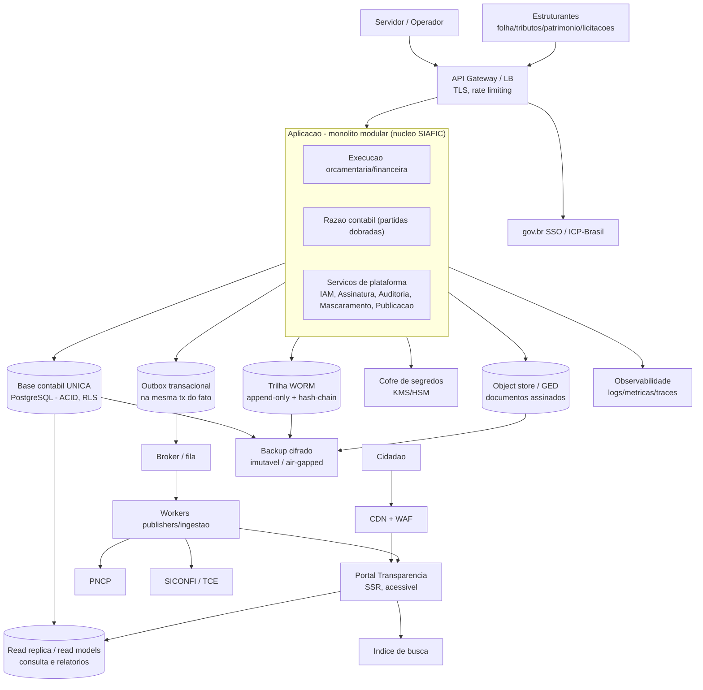

# Arquitetura técnica

[← Índice geral](../README.md) · [Arquitetura conceitual](../03-arquitetura.md) · [Plataforma e transversais](../11-plataforma-transversal.md)

> O **“como se constrói”**: componentes de infraestrutura, linguagem ideal por situação, decisões de arquitetura (ADRs) e um **stress test lógico** (caso de uso × cenário de falha × comportamento esperado). Complementa o [03-arquitetura](../03-arquitetura.md) (conceitual) e o [13-nfr-e-operacao](../13-nfr-e-operacao.md) (não-funcionais).
>
> **Natureza deste documento:** decisões **propostas** para um build greenfield, a serem ratificadas pelo time. As recomendações de linguagem são por **mérito técnico + ecossistema brasileiro**; **familiaridade do time é override legítimo** (uma casa .NET/Java/PHP deve pesar isso). O que **não** é negociável são as *propriedades* (ACID no razão, idempotência na borda, trilha imutável, isolamento multi-ente), não a tecnologia que as entrega.

---

## 1. Princípios que a arquitetura precisa honrar

Derivados dos docs de produto — são as invariantes que qualquer escolha técnica tem de sustentar:

- **Base contábil única = fonte da verdade** ([03](../03-arquitetura.md)): um fato entra uma vez; escrituração, transparência e consolidação derivam dela.
- **Correção financeira**: partidas dobradas (Σdébito = Σcrédito), saldos nunca negativos, dinheiro em **decimal exato** (jamais ponto flutuante).
- **Imutabilidade e trilha** ([05](../05-regras-de-negocio.md), [07-fluxo 7](../04-fluxos.md#7-trilha-de-auditoria-e-vedações)): nada consolidado se apaga; correção por estorno; toda operação (inclusive leitura de PII) deixa rastro.
- **Tempo real** ([transparência](../transversais/03-transparencia.md)): publicação ≤ 1º dia útil após o registro.
- **Multi-ente com isolamento** (decisão de tenancy, [03](../03-arquitetura.md)): um vazamento cross-tenant reprova no controle externo.
- **Plataforma de serviços** ([11](../11-plataforma-transversal.md)): IAM, assinatura, auditoria, publicação, mascaramento — contratos estáveis, herdados pelos módulos.
- **Piso de segurança F0** ([13](../13-nfr-e-operacao.md#piso-de-segurança-f0)) e **custo-de-servir baixo** (wedge de municípios pequenos).

## 2. Estilo de arquitetura (decisão macro)

**Monólito modular** (modular monolith) com **borda orientada a eventos** — não microserviços no MVP.

- O **núcleo transacional** (razão, execução, fechamento) vive num único deployable com **uma transação ACID** por fato — evita a saga distribuída onde a lei exige atomicidade contábil.
- A **borda de publicação/integração** é assíncrona (outbox → broker → workers), onde eventual-consistência é aceitável (transparência ≤ 1 dia útil, PNCP/SICONFI em lote).
- Módulos com **fronteiras internas explícitas** (execução, razão, plataforma) para poder extrair um serviço depois **se** a escala exigir — sem pagar o custo distribuído antes da hora.

Racional: para o *wedge* de municípios pequenos, microserviços multiplicam custo operacional e introduzem consistência distribuída num domínio que é **fortemente transacional**. Monólito modular entrega correção + baixo custo, e o modelo multi-ente escala horizontalmente por réplica de leitura e por pool de tenants.

## 3. Componentes de infraestrutura

| Componente | Papel | Escolha e nota |
| --- | --- | --- |
| **CDN + WAF** | Absorve picos e ataques no portal público; cache de dados abertos | Provê disponibilidade (Dec. 10.540 art. 9º); serve *bulk* por arquivo versionado |
| **API Gateway / LB** | TLS, rate limiting, roteamento, quotas | Borda única; sem lógica de negócio |
| **Aplicação (monólito modular)** | Núcleo + serviços de plataforma | Um deployable transacional; módulos com fronteiras internas |
| **Base contábil única** | Fonte da verdade OLTP | **PostgreSQL** — ACID, `NUMERIC` para dinheiro, constraints, **RLS** multi-tenant — [schema DDL](./razao-contabil-schema.md) · [motor de partidas dobradas (domínio)](./motor-razao-partidas-dobradas.md) |
| **Read replica / read models** | Consulta pública e relatórios pesados (RREO/RGF) | Nunca onerar o *primary* OLTP; CQRS-lite |
| **Outbox transacional** | Garante publicação sem perder/duplicar | Gravado **na mesma transação** do fato; relê e despacha |
| **Broker / fila** | Desacopla publicação e ingestão | Entrega ao menos uma vez + idempotência nos consumidores |
| **Workers (publishers/ingestão)** | Transparência, PNCP, SICONFI/TCE; ingestão ePING | Stateless, escaláveis, retentativa com backoff, DLQ |
| **Trilha de auditoria (WORM)** | Log imutável append-only + hash-chain | **Store segregado** do razão; replicação externa; retenção parametrizável |
| **Object store / GED** | Documentos assinados (PDF/PAdES) | Fora do banco (não BLOB no DB); cifrado em repouso |
| **Cofre de segredos (KMS/HSM)** | Chaves, credenciais gov.br/PNCP/banco | Sem segredo em código; rotação; contas de serviço de privilégio mínimo |
| **IAM / IdP** | Autenticação e RBAC | **gov.br SSO** (cidadão/servidor) + certificado ICP-Brasil; RBAC/ABAC interno |
| **Índice de busca** | Busca/filtros da transparência | Índice derivado (reconstruível a partir da base) |
| **Observabilidade** | Logs, métricas, traces, alertas | Detecção de anomalia (piso F0); correlação por id de transação |
| **Backup** | Continuidade | Cifrado, **cópia imutável/air-gapped**, teste de restauração periódico (art. 15) |
| **Ambientes** | prod · homologação · treino | Inclui `treina.pncp.gov.br` e homologação gov.br; **sem PII real fora de produção** |

## 4. Linguagem/stack ideal por situação

| Situação | Recomendada | Por quê | Alternativa |
| --- | --- | --- | --- |
| **Núcleo contábil / motor de partidas dobradas** | **JVM — Kotlin/Java (Spring Boot + jOOQ/Hibernate)** | Correção financeira (`BigDecimal`, transações maduras); **maior ecossistema ICP-Brasil/PAdES do Brasil** (libs de assinatura oficiais são Java); maior pool de contratação em gov | **C#/.NET** (co-equivalente, se for casa Microsoft) |
| **API / back-end de aplicação** | Mesma do núcleo (JVM ou .NET) | Um só runtime transacional evita *polyglot sprawl* num time pequeno | — |
| **Workers de integração / ingestão** | **Go** (opcional) ou a mesma JVM | I/O-bound, alta concorrência, **binário único** = deploy barato por ente | Manter na JVM para simplificar o time |
| **Pipeline de dados / ETL / migração** | **Python** (pandas) | De-para PCASP, conciliação, cargas; produtividade em manipulação de dados | JVM (Spring Batch) se preferir um runtime só |
| **Portal da transparência (cidadão)** | **TypeScript + SSR (Next.js/Nuxt)** | Acessibilidade (WCAG 2.2 AA), SEO, HTML semântico server-side; adota **Design System gov.br** | — |
| **Back-office (servidor)** | **TypeScript SPA (React/Vue)** | Formulários ricos, RBAC no cliente; reusa o DS gov.br | — |
| **Relatórios/matrizes (RREO/RGF/MSC/DCA)** | JVM (mesma do núcleo) sobre read models | Precisa dos mesmos tipos monetários e regras contábeis | Python para protótipo |
| **Assinatura/cripto** | Bibliotecas da plataforma (JVM: BouncyCastle/iText; .NET equivalente) | Não reimplementar cripto; PAdES/CAdES prontos | — |
| **Infra como código / deploy** | **Docker + Terraform**; orquestração K8s **só quando** a escala pedir | Reprodutível; começar simples (compose/VM) para município pequeno | Nomad/compose no início |

> **Decisão de consolidação (anti-*polyglot*):** stack primária de back-end = **JVM (Kotlin/Java)** — decidido em [ADR-0012](./adr/0012-stack-jvm.md) — + **TypeScript** nos front-ends + **Python** para dados/migração. **Go** só entra se e quando os workers de integração justificarem o custo de um segundo runtime. Cada linguagem adicional precisa **pagar** o custo de contratação/manutenção que impõe.

## 5. Decisões de arquitetura (ADRs)

As decisões são **versionadas** em [`adr/`](./adr/) — uma por arquivo, com **Status** que evolui (Proposta → Aceita → Substituída); nunca se edita a decisão original, versiona-se. Índice: [adr/README](./adr/README.md).

- [0001](./adr/0001-base-unica-postgresql.md) Base única PostgreSQL · [0002](./adr/0002-monolito-modular.md) Monólito modular · [0003](./adr/0003-multi-tenant-rls.md) Multi-tenant RLS · [0004](./adr/0004-outbox-idempotente.md) Outbox idempotente · [0005](./adr/0005-trilha-append-only-hash-chain.md) Trilha hash-chain · [0006](./adr/0006-dinheiro-decimal.md) Dinheiro decimal
- [0007](./adr/0007-read-models-cqrs.md) Read models/CQRS · [0008](./adr/0008-assinatura-provedor.md) Assinatura via provedor · [0009](./adr/0009-documentos-object-store.md) Documentos no object store · [0010](./adr/0010-single-writer-failover.md) Single-writer · [0011](./adr/0011-idempotencia-ponta-a-ponta.md) Idempotência ponta a ponta · [0012](./adr/0012-stack-jvm.md) **Stack JVM** · [0013](./adr/0013-persistencia-lote-fail-soft.md) Persistência em lote fail-soft
- [0014](./adr/0014-contratos-plataforma-ports.md) Contratos de plataforma como ports · [0015](./adr/0015-atribuicao-tenant-explicita-no-contrato.md) Tenant explícito no contrato (`ente`) · [0016](./adr/0016-controle-acesso-mfa-movimentacao-recurso.md) ControleAcesso RBAC+MFA · [0017](./adr/0017-bff-oauth-assinatura-govbr.md) BFF OAuth2 assinatura gov.br · [0018](./adr/0018-object-store-s3-compativel.md) Object store S3-compatível · [0020](./adr/0020-f0-tls-backup-imutavel-restauracao.md) F0: TLS + backup imutável + restauração (0019 não utilizado — ver [índice](./adr/README.md))

## 6. Stress test lógico (caso de uso × cenário de falha)

Para cada caso de uso, os cenários de falha e o **comportamento esperado**. Garantias recorrentes: **transação ACID** (o fato ou é atômico ou não acontece), **outbox** (publicação não se perde), **idempotência** (reprocessar não duplica), **timestamp autoritativo do servidor** (anti-backdating), **RLS** (isolamento), **trilha** (tudo rastreável).

### UC1 — Execução da despesa (empenho → liquidação → pagamento)

| Cenário de falha | O que acontece | Mecanismo/garantia |
| --- | --- | --- |
| Dois empenhos concorrentes esgotam a mesma dotação | Um comita, o outro **falha e é rejeitado** (saldo insuficiente) | Lock pessimista/serializable + constraint `saldo ≥ 0` no banco |
| Crash entre gravar o empenho e publicar na transparência | Empenho **persistido**; publicação ocorre depois pelo worker | Outbox na mesma tx; retentativa |
| Tentativa de registrar com data retroativa em período **encerrado** | **Bloqueado** | Trava de período + timestamp de registro imutável ([Regra 2](../05-regras-de-negocio.md)) |
| Liquidação sem documento de suporte | **Bloqueada** | Trava de negócio (Lei 4.320 art. 63) |
| Pagamento sem beneficiário (exceto folha) | **Bloqueado** | Trava; exceção só no gate de folha consolidada |
| Pagamento > valor liquidado | **Rejeitado** | Invariante `pago ≤ liquidado ≤ empenhado` |
| Falha ao assinar a nota de empenho (gov.br fora) | Registro fica **pendente de assinatura**; execução seguinte (pagamento) **gated**; reassinatura ao voltar | Assinatura assíncrona com status; sem estado parcial consolidado |

### UC2 — Execução da receita

| Cenário de falha | O que acontece | Mecanismo/garantia |
| --- | --- | --- |
| Arquivo bancário de arrecadação duplicado | Segundo processamento **deduplicado** | Chave de idempotência por lote/documento |
| Dado sob sigilo fiscal iria à transparência | **Não exposto** individualmente; publicado agregado | Regra de mascaramento na fronteira (CTN art. 198) |
| Conciliação diverge (arrecadado ≠ recolhido) | Registra **divergência**, não consolida | Validação de conciliação |

### UC3 — Integração com estruturantes (ingestão ePING)

| Cenário de falha | O que acontece | Mecanismo/garantia |
| --- | --- | --- |
| Origem não confiável / assinatura inválida | **Rejeita** e loga | mTLS + HMAC + allowlist ([Fluxo 5](../04-fluxos.md#5-integração-com-sistemas-estruturantes)) |
| Mesma mensagem enviada duas vezes | **Ignora a duplicata** | Inbox idempotente (`exactly-once` lógico) |
| Mensagem malformada (*poison message*) | Vai para **DLQ** + alerta; não bloqueia a fila | Dead-letter queue |
| Estruturante fora do ar por horas | Mensagens **enfileiram**; processa ao voltar | Broker durável + backoff |
| Pico de lote (fechamento) | Absorvido; workers escalam | Fila + workers stateless |

### UC4 — Assinatura de documento

| Cenário de falha | O que acontece | Mecanismo/garantia |
| --- | --- | --- |
| gov.br/ICP indisponível no ato | Documento **não assinado**, estado "pendente"; retoma depois | Sem estado parcial; idempotência da transação de assinatura |
| Certificado revogado no momento | Assinatura **recusada** | Checagem OCSP/CRL no ato ([spec 01](../transversais/01-assinatura-eletronica.md)) |
| Certificado expira depois (guarda longa) | Continua **verificável** | PAdES-LTV com OCSP/CRL + carimbo de tempo embutidos |
| Documento assinado precisa de correção | **Estorno + novo documento** assinado; original íntegro | Regras 3/4; nunca reassinar por cima |

### UC5 — Transparência (publicação)

| Cenário de falha | O que acontece | Mecanismo/garantia |
| --- | --- | --- |
| Pipeline de publicação cai | Fatos **persistidos**; publicam ao voltar, ainda no SLA de 1 dia útil | Outbox + retentativa |
| Canal (CSV/JSON/API) vazaria campo não-mascarado | **Build falha**; não vai ao ar | Teste de regressão de mascaramento uniforme |
| Scraping massivo para re-identificação | Mitigado sem bloquear download legítimo | Rate limiting/quotas/CDN; *bulk* por arquivo versionado |
| Read model dessincronizado | **Reconstruível** a partir da base única | Derivados são recomputáveis |

### UC6 — Fechamento de período

| Cenário de falha | O que acontece | Mecanismo/garantia |
| --- | --- | --- |
| Lançamento chega durante o encerramento | Aceito no período aberto **ou** rejeitado se o período fechou | Checagem transacional de estado no commit |
| Balancete de encerramento não fecha (D≠C) | Encerramento **bloqueado** | Invariante Σdébito=Σcrédito |
| Ajuste após encerramento | Só por **estorno/retificação** no período aberto | Trava de período |

### UC7 — Prestação de contas (SICONFI/MSC/TCE)

| Cenário de falha | O que acontece | Mecanismo/garantia |
| --- | --- | --- |
| Dados inconsistentes na geração da matriz | **Aponta inconsistência**, não envia; corrige na origem | Validação prévia ([Fluxo 10](../04-fluxos.md#10-consolidação-nacional-siconfi)) |
| Envio ao SICONFI/TCE falha | **Retentativa**; trilha de geração/envio | Outbox + log de envio |
| Prazo legal se aproxima (RREO/RGF/DCA) | **Alerta** proativo | Calendário legal parametrizável |

### UC8 — Migração / carga de abertura

| Cenário de falha | O que acontece | Mecanismo/garantia |
| --- | --- | --- |
| Balancete de abertura ≠ encerramento do legado | **Bloqueia cutover**; relatório de divergência | Conciliação obrigatória ([12-migracao](../12-migracao.md)) |
| Carga precisa ser refeita | **Dry-run/reversível** antes de consolidar | Ambiente de homologação |
| De-para de conta legada→PCASP incompleto | Registro **retido** para correção | Validação do mapeamento |

### UC9 — Acesso e infraestrutura (transversal)

| Cenário de falha | O que acontece | Mecanismo/garantia |
| --- | --- | --- |
| Consulta sem filtro de tenant | **Negada** (deny-by-default) | RLS + teste de vazamento no CI |
| Perfil tenta lançar **e** autorizar o mesmo ato | **Vetado** | Segregação de funções ([Regra 9](../05-regras-de-negocio.md)) |
| Tentativa de adulterar a trilha | **Detectada** | Hash-chain + store WORM segregado |
| `primary` do banco cai | **Failover** com fencing; sem split-brain | Single-writer + réplica promovida (RTO no [NFR](../13-nfr-e-operacao.md)) |
| Pool de conexões esgota / disco cheio | Degrada com **health check**/circuit breaker; alerta | Observabilidade + limites |
| Desastre no site primário | Restauração no DR dentro do RPO/RTO | Backup imutável + teste de restauração |
| Segredo vaza em log/código | Prevenido; rotação | Cofre KMS/HSM; proibição de segredo em código |

## 7. Riscos e pontos abertos

- **Escala do *primary***: entes muito grandes (capitais/estados) podem exigir particionamento por exercício/órgão ou extração de um serviço de leitura — reavaliar ADR-1/ADR-2 por porte.
- **Segundo runtime (Go/Python)**: só introduzir com justificativa de custo; medir antes.
- **Publisher PNCP**: vive no módulo de licitações (estruturante) — fora deste núcleo ([spec 02](../transversais/02-pncp.md)); aqui só o *gate* de eficácia.
- **Kotlin × Java** (dentro da JVM): definido que é JVM ([ADR-0012](./adr/0012-stack-jvm.md)); a escolha entre Kotlin e Java fica a critério do time.
- **Validar citações legais** na fonte oficial antes de fixar qualquer trava em código.

## 8. Guardrails automatizados

O [guardião](../../.claude/skills/guardiao/SKILL.md) (`/guardiao`) é a camada **semântica**; as camadas mais fortes são impostas pelo **build** e pelo **CI** — conformidade por construção, não por disciplina.

### Build-time (JVM) — falha a compilação/o build

- **ArchUnit:** fronteiras de módulo (execução/razão/plataforma só por interfaces); domínio não depende de infraestrutura; **proibir `float`/`double`/`Float`/`Double`** em domínio financeiro ([ADR-0006](./adr/0006-dinheiro-decimal.md)); **proibir data/timestamp do cliente** para registro (usar `Clock` injetado); repositórios do razão **sem** `delete`/`update` (append-only).
- **Error Prone / NullAway / SpotBugs / Checkstyle / PMD:** nulidade, bugs, estilo; regra custom para dinheiro = `BigDecimal`.

### CI — falha o pipeline

- **Teste de vazamento cross-tenant** (RLS deny-by-default) — bloqueante ([ADR-0003](./adr/0003-multi-tenant-rls.md)).
- **Teste de regressão de mascaramento** — nenhum canal público expõe PII ([LGPD](../transversais/04-lgpd.md)).
- **Testes de invariante no banco** — Σdébito=Σcrédito, imutabilidade, período, numeração ([schema](./razao-contabil-schema.md#como-o-guardião-testa-isto)).
- **gitleaks** (segredo em código), **OWASP dependency-check/SBOM**, **reversibilidade de migração** (Flyway/Liquibase up+down).

### Hook (Claude Code) — automação local

- `Stop`/`PostToolUse` dispara o `/guardiao` sobre o diff; pré-commit roda os greps rápidos (float-money, segredo). Configurável em `settings.json` (hooks).

> Regra: cada invariante do [guardião](../../.claude/skills/guardiao/SKILL.md) tem **pelo menos uma** camada automatizada acima; o que não é testável por máquina fica com a revisão semântica do guardião.

---

[← Índice geral](../README.md) · [Arquitetura conceitual](../03-arquitetura.md) · [Schema do razão](./razao-contabil-schema.md) · [ADRs](./adr/) · [NFR e operação](../13-nfr-e-operacao.md)
