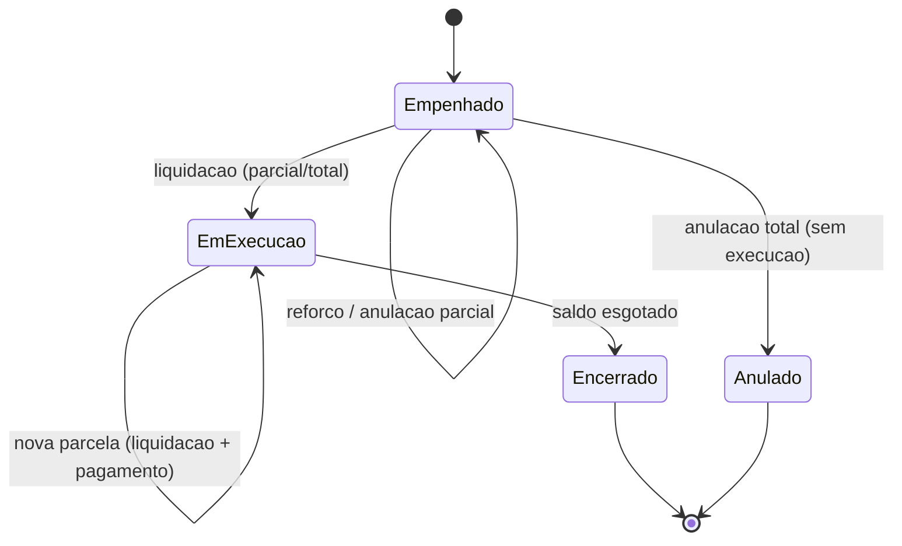
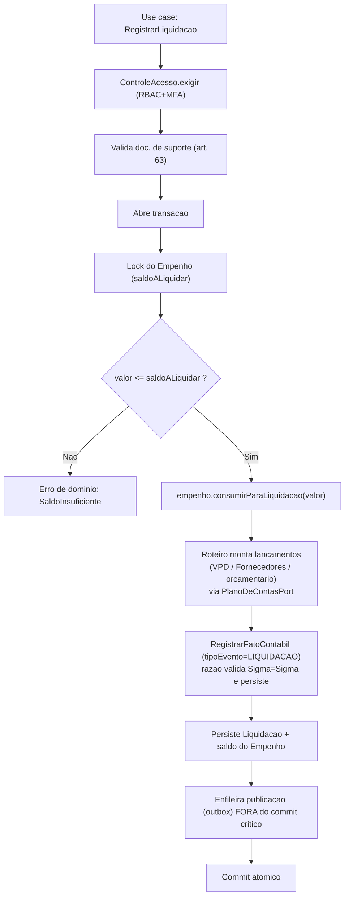

# Execução orçamentária da despesa (domínio do módulo `execucao`)

[← Arquitetura técnica](./README.md) · [Motor de partidas dobradas (razão)](./motor-razao-partidas-dobradas.md) · [Schema do razão (DDL)](./razao-contabil-schema.md) · [Modelo de dados](../10-modelo-dados.md) · [ADR-0021 Contabilização da execução](./adr/0021-contabilizacao-execucao-despesa.md) · [Fluxo do operador + contrato de API (RAZ-79)](./fluxo-execucao-operador-contrato-api.md)

> Design do **domínio/aplicação** (JVM, monólito modular — [ADR-0002](./adr/0002-monolito-modular.md)) do módulo `execucao`: os agregados `Dotacao`, `Empenho`, `Liquidacao`, `Pagamento`, seus saldos de controle, o ciclo de vida da despesa (**Lei 4.320/1964 arts. 58–65**) e — o ponto central — como **cada estágio da execução vira fato(s) contábil(is)** no [razão](./motor-razao-partidas-dobradas.md), append-only e Σdébito=Σcrédito. É a contraparte de execução do que o [motor de razão](./motor-razao-partidas-dobradas.md) é para o núcleo contábil. **Este documento é desenho — não implementa** ([RAZ-65]); a implementação Kotlin/Java nasce depois, contra estes contratos.

## O que é e base legal

A **execução da despesa** é o núcleo operacional do SIAFIC: a despesa fixada na LOA percorre os **estágios** da Lei 4.320/1964 — **empenho** (art. 58–60), **liquidação** (art. 63) e **pagamento** (art. 64–65) — cada um consumindo um saldo do estágio anterior e **gerando escrituração automática por partidas dobradas** na mesma base contábil. O módulo `execucao` **não é o razão**: ele é o **produtor** que traduz cada evento de negócio numa lista de lançamentos balanceados e chama o motor do razão ([motor-razao §"não preciso"](./motor-razao-partidas-dobradas.md#o-que-não-preciso-implementar-fora-de-escopo--delegável)).

Base legal do vínculo e das cardinalidades ([10-modelo-dados §cardinalidades](../10-modelo-dados.md#cardinalidades-e-base-legal)): art. 59 (empenho ≤ crédito), art. 60 §2º/§3º (empenho estimativo/global → N liquidações), arts. 62–65 (pagamento parcial → N pagamentos por liquidação). A escrituração por partidas dobradas está ancorada em LRF art. 50 §2º, Lei 4.320 art. 85 e Portaria STN vigente (MCASP/PCASP) — **os códigos de conta PCASP citados adiante são representativos e devem ser revalidados na fonte oficial** antes de fechar qualquer roteiro em código.

### Estágios da despesa e vínculo orçamentário

| Estágio | Ato | Saldo que consome | Saldo que abre |
| --- | --- | --- | --- |
| **Fixação** | Carga da LOA + créditos adicionais (B.2a, F1) cria as `Dotacao` | — | `dotacao.saldoDisponivel` |
| **(Reserva)** *(opcional)* | Pré-empenho reserva crédito antes do empenho | `saldoDisponivel` | `saldoReservado` |
| **Empenho** (art. 58) | Compromete crédito para um credor | `saldoDisponivel` (art. 59) | `empenho.saldoALiquidar` |
| **Liquidação** (art. 63) | Verifica o direito adquirido (entrega + doc. de suporte) | `saldoALiquidar` | `liquidacao.saldoAPagar` |
| **Pagamento** (art. 64–65) | Ordem bancária / baixa financeira | `saldoAPagar` | — |

> A **liquidação é o fato gerador da despesa por competência** (Lei 4.320 art. 35): é nela — não no empenho — que nasce a **variação patrimonial diminutiva (VPD)** e a obrigação com o fornecedor (passivo). O empenho é mera **reserva orçamentária**; o pagamento é **baixa financeira** do passivo. Isso governa em que estágio cada subsistema PCASP é tocado (ver [ADR-0021](./adr/0021-contabilizacao-execucao-despesa.md)).

## O que PRECISO modelar (agregados e invariantes)

Agregados **pequenos**, um por unidade de consistência transacional; relacionamento **por identidade** (não composição em árvore), porque um empenho estimativo de energia acumula dezenas de liquidações/pagamentos ao longo do exercício e carregar a árvore inteira para registrar uma parcela seria custoso e contencioso.

- **`Dotacao`** (raiz — vínculo orçamentário). `classificacaoOrcamentaria`, `fonteRecurso`, `exercicio`, `valorAutorizado`, `saldoDisponivel`, `saldoReservado`. Métodos: `reservar(valor)`, `comprometer(valor)` (empenho), `liberar(valor)` (anulação devolve crédito). **Invariante: `saldoDisponivel ≥ 0`** (art. 59). A carga da LOA (B.2a) e os créditos adicionais (Lei 4.320 arts. 40–46) populam/alteram `valorAutorizado`.
- **`Empenho`** (raiz). `numeroSequencial` (gapless por ente/exercício), `tipo` (`ORDINARIO`/`ESTIMATIVO`/`GLOBAL`, art. 60), `valorEmpenhado`, `saldoALiquidar`, `classificacaoOrcamentaria`, `fonteRecurso`, `dotacaoId`, `credorId` (→ `Pessoa`, cadastro/plataforma), `contratoId` (opcional), `estado` (ver ciclo de vida), `documentoEmpenhoId` (nota de empenho assinada, → object store). Métodos: `emitir(...)`, `reforcar(valor)`, `anular(valor)` (parcial/total). **Invariantes: `saldoALiquidar ≥ 0`; Σ liquidado ≤ `valorEmpenhado`; documento assinado antes de liberar pagamento** ([UC1](./README.md#uc1--execução-da-despesa-empenho--liquidação--pagamento)).
- **`Liquidacao`** (raiz). `numeroSequencial`, `empenhoId`, `valor`, `saldoAPagar`, `dataCompetencia`, `documentosSuporte` (≥1, **obrigatório**, art. 63 §2º — `ReferenciaDocumento`). Métodos: `registrar(...)`, `consumirParaPagamento(valor)`. **Invariantes: `saldoAPagar ≥ 0`; `valor ≤ saldoALiquidar` do empenho; ao menos um documento de suporte.**
- **`Pagamento`** (raiz — folha da cadeia). `numeroSequencial`, `liquidacaoId`, `valor`, `beneficiarioId` (CPF/CNPJ **exigido**, exceto folha consolidada), `ordemBancariaId` (opcional — a OB pode **agrupar** vários pagamentos, N:1). Método: `efetuar(...)`. **Invariante: `valor ≤ saldoAPagar` da liquidação.**
- **`MovimentoEmpenho`** (entidade interna do `Empenho`). Reforço/anulação são **movimentos novos** append-only — o `valorEmpenhado` original nunca sofre `UPDATE` destrutivo (mesma disciplina de correção-por-movimento do razão; [Regra 4](../05-regras-de-negocio.md)). `valorEmpenhado` vigente = valor original ± Σ movimentos.
- **Value objects** (pt-BR, sem framework): `ClassificacaoOrcamentaria` (função/subfunção/programa/ação, natureza da despesa, modalidade, elemento), `FonteDestinacaoRecurso`, `TipoEmpenho`, `EstagioDespesa`, `NumeroSequencial`. Dinheiro sempre `Dinheiro`/`BigDecimal` ([ADR-0006](./adr/0006-dinheiro-decimal.md)).

### Dois saldos, dois donos (invariante-chave de fronteira)

| Saldo | Dono | Consistência | Papel |
| --- | --- | --- | --- |
| **Operacional** (`saldoDisponivel`, `saldoALiquidar`, `saldoAPagar`) | agregados de `execucao` | **forte**, mutado sob **lock de linha** na mesma transação do movimento | trava sincronamente o *overspend* (empenho ≤ crédito, liquidação ≤ empenhado, pagamento ≤ liquidado) |
| **Contábil** (saldo das contas PCASP) | `razao` (view/read-model derivado, [ADR-0007](./adr/0007-read-models-cqrs.md)) | **eventual** | fonte da verdade contábil; nunca trava operação em tempo real |

> Os dois saldos **reconciliam** (o `saldoALiquidar` operacional ↔ saldo da conta orçamentária "Crédito Empenhado a Liquidar"), mas têm **donos e garantias distintas**: o operacional é a trava que impede gastar além do saldo (checada com lock, à prova de concorrência — [UC1: dois empenhos concorrentes](./README.md#uc1--execução-da-despesa-empenho--liquidação--pagamento)); o contábil é derivado do razão e serve relatório/consulta. Tratar o saldo derivado do razão como trava de execução seria uma corrida — por isso a duplicidade é **deliberada**, não redundância acidental.

## Como cada evento vira fato contábil (visão; detalhe no ADR-0021)

Cada movimento de execução, **na mesma transação de banco**, (1) mexe no saldo operacional sob lock, (2) monta a lista de `Lancamento` via **roteiro de contabilização** e (3) chama `RegistrarFatoContabil` do razão. O razão só valida Σ=Σ e persiste append-only — **ignora** o que é um empenho.

| Evento (`TipoEvento`) | Subsistemas PCASP tocados | Mecânica (representativa — **revalidar MCASP/PCASP**) |
| --- | --- | --- |
| **Empenho** | Orçamentário + Controle (DDR) | D `6.2.2.1.1` Crédito Disponível → C `6.2.2.1.3` Crédito Empenhado a Liquidar; controle da disponibilidade por fonte (classes 7/8) |
| **Liquidação** | Patrimonial + Orçamentário | D `3.x` VPD (competência) → C `2.1.3` Fornecedores a Pagar; D `6.2.2.1.4` Empenhado Liquidado a Pagar → C `6.2.2.1.3` Empenhado a Liquidar |
| **Pagamento** | Patrimonial/Financeiro + Orçamentário + Controle | D `2.1.3` Fornecedores a Pagar → C `1.1.1` Caixa/Bancos; D `6.2.2.1.5` Empenhado Pago → C `6.2.2.1.4` Liquidado a Pagar; baixa da DDR |
| **Reforço** | Orçamentário | mesmo do empenho, valor incremental |
| **Anulação** | Orçamentário (+ Controle) | inverso do empenho; devolve crédito à dotação |

Cada linha acima fecha **Σdébito=Σcrédito por subsistema**, logo o fato inteiro fecha Σ=Σ (pré-requisito do razão). A **correção** de qualquer estágio é por **estorno** no razão (novo fato invertido) + movimento novo na execução — original íntegro ([Regras 3/4](../05-regras-de-negocio.md)).

## Ciclo de vida do empenho

## Ports (no `execucao-domain`, dependências para dentro — ADR-0002)

- **Repositórios** (interfaces no `domain`, adapters na `infra`): `DotacaoRepository`, `EmpenhoRepository`, `LiquidacaoRepository`, `PagamentoRepository`. Diferente do razão, **não** são append-only puros — os saldos operacionais mutam; mas reforço/anulação são **movimentos append** e o registro original de valor é preservado.
- **`PlanoDeContasPort`**: resolve `codigoPcasp → contaId` (do `conta_pcasp` do ente) para o roteiro montar lançamentos. Leitura; sem escrita.
- **Colaborador do razão**: o use case de execução chama `RegistrarFatoContabil` (use case do `razao-application`) passando `tipoEvento`, `origem` (URN do movimento, ex.: `execucao:pagamento:{id}`) e a `List<Lancamento>` — **é a única porta de entrada da escrituração** ([motor-razao](./motor-razao-partidas-dobradas.md)).
- **Plataforma** ([ADR-0014](./adr/0014-contratos-plataforma-ports.md)): `ControleAcesso` (RBAC+MFA — empenho/liquidação/pagamento **movimentam recurso**, [ADR-0016](./adr/0016-controle-acesso-mfa-movimentacao-recurso.md)); `ServicoAssinatura`/`ArmazenamentoDocumentos` (nota de empenho, doc. de suporte, OB — [ADR-0008](./adr/0008-assinatura-provedor.md)/[0009](./adr/0009-documentos-object-store.md)/[0018](./adr/0018-object-store-s3-compativel.md)); `ServicoEntrega` (publicar na transparência via **outbox**, [ADR-0004](./adr/0004-outbox-idempotente.md) — nunca síncrono na transação do fato); `AuditoriaEscrita` (trilha).

## Fluxo (registro de uma liquidação — exemplar)

## Fronteiras (execução × razão × plataforma)

- **execução → razão:** dependência **unidirecional**. Execução conhece o razão (chama `RegistrarFatoContabil`); o razão **não** conhece empenho/liquidação/pagamento (seu `TipoEvento` já os nomeia, mas o motor não tem regra de despesa). Toda escrituração passa pelo motor — execução **nunca** escreve em `fato_contabil`/`lancamento` direto.
- **execução → plataforma:** só por **ports** do `plataforma-domain` ([ADR-0014](./adr/0014-contratos-plataforma-ports.md)); acesso, assinatura, documentos, entrega e auditoria são serviços transversais herdados.
- **Atomicidade:** o movimento de execução + o(s) fato(s) contábil(is) commitam **na mesma transação** (base única — [ADR-0001](./adr/0001-base-unica-postgresql.md)); o efeito externo (transparência) sai **assíncrono** via outbox. Fail-soft do [ADR-0013](./adr/0013-persistencia-lote-fail-soft.md) **não** se aplica ao par movimento+fato (é all-or-nothing), só à ingestão em lote (carga da LOA/migração).
- **Tenancy:** todo agregado carrega `ente` explícito ([ADR-0015](./adr/0015-atribuicao-tenant-explicita-no-contrato.md)) sob RLS deny-by-default ([ADR-0003](./adr/0003-multi-tenant-rls.md)).

## Faseamento

| Fase | Entrega |
| --- | --- |
| **F0** | — (razão, IAM, trilha, plataforma já entregues; execução não faz parte do F0). |
| **F1 (MVP/go-live)** | Este desenho ([RAZ-65]) → implementação: agregados + use cases (empenho/reforço/anulação, liquidação, pagamento) + roteiro de contabilização + adapters Postgres; carga da LOA/dotações (B.2a); restos a pagar + trava LRF art. 42. Requer o razão implementado ([RAZ-4]) e o scaffold ([RAZ-1]). |
| **F2** | Conciliação bancária, ordem bancária agrupadora, integração com estruturantes (empenho a partir de contrato/licitação). |

## O que NÃO faz parte deste desenho

- **Implementação** (código `src/`) — [RAZ-65] é desenho; a issue é explícita: *não implementar ainda*.
- **Motor do razão** (agregado `FatoContabil`, Σ=Σ, estorno, numeração gapless) — já desenhado em [motor-razao-partidas-dobradas](./motor-razao-partidas-dobradas.md) e implementado ([RAZ-4]); execução **consome**.
- **Roteiro PCASP fechado com códigos definitivos** — a **mecânica** está no [ADR-0021](./adr/0021-contabilizacao-execucao-despesa.md); os códigos exatos são revalidados na fonte oficial (MCASP/PCASP) antes de virar tabela de-para em código.
- **Execução da receita** — domínio irmão, versão futura ([04-fluxo 3](../04-fluxos.md#3-execução-da-receita)).
- **Restos a pagar / fechamento** — F1, mas issues próprias que consomem este modelo.

## Fontes

- [10 · Modelo de dados — ciclo da despesa](../10-modelo-dados.md) (agregados, cardinalidades, travas)
- [Motor de partidas dobradas (razão)](./motor-razao-partidas-dobradas.md) · [Schema do razão (DDL)](./razao-contabil-schema.md)
- [04 · Fluxo 2 — Execução da despesa](../04-fluxos.md#2-execução-da-despesa) · [05 · Regras de negócio](../05-regras-de-negocio.md)
- [ADR-0021 Contabilização da execução da despesa](./adr/0021-contabilizacao-execucao-despesa.md) · [ADR-0002](./adr/0002-monolito-modular.md) · [ADR-0006](./adr/0006-dinheiro-decimal.md) · [ADR-0007](./adr/0007-read-models-cqrs.md) · [ADR-0014](./adr/0014-contratos-plataforma-ports.md) · [ADR-0016](./adr/0016-controle-acesso-mfa-movimentacao-recurso.md)
- Lei 4.320/1964 arts. 35, 58–65 · LRF art. 50 §2º · Portaria STN MCASP/PCASP (**revalidar na fonte oficial**)

---

[← Arquitetura técnica](./README.md) · [Motor de razão](./motor-razao-partidas-dobradas.md) · [Modelo de dados](../10-modelo-dados.md) · [ADR-0021](./adr/0021-contabilizacao-execucao-despesa.md)
