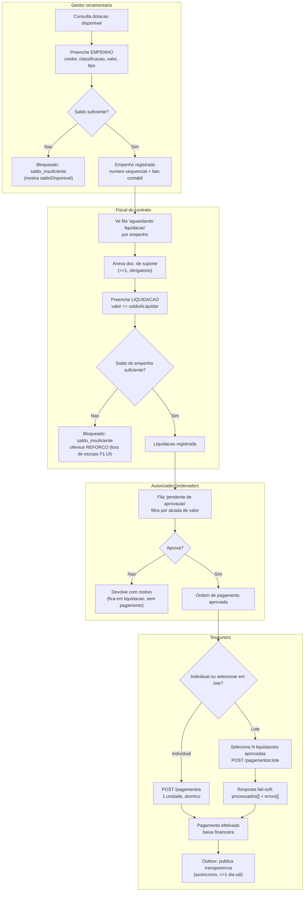

# Fluxo do operador e contrato de API — execução da despesa (F1)

[← Arquitetura técnica](./README.md) · [Execução orçamentária (domínio, RAZ-65)](./execucao-orcamentaria-despesa.md) · [ADR-0022 Lote de pagamento](./adr/0022-lote-pagamento-contrato-api-execucao.md) · [ADR-0023 Gate de aprovação](./adr/0023-gate-aprovacao-pagamento-segregacao.md) · [ADR-0013 fail-soft](./adr/0013-persistencia-lote-fail-soft.md) · [ADR-0016 RBAC+MFA](./adr/0016-controle-acesso-mfa-movimentacao-recurso.md)

> Design de **produto/UX** (RAZ-79) sobre o domínio já modelado em [RAZ-65](./execucao-orcamentaria-despesa.md) e parcialmente implementado (RAZ-66 empenho *in progress*, RAZ-67 liquidação/pagamento *done*). Objetivo: mapear o fluxo do **operador** (não do agregado) — quem faz o quê, em que tela, com que payload — e fechar o **contrato de API** que a UI vai consumir. **Este documento não constrói tela**; é o contrato contra o qual a tela nasce depois.
>
> **Ratificado (RAZ-88, Aurélio, 2026-07-26):** a decisão de lote (§4) foi confirmada sem ajuste em [ADR-0022](./adr/0022-lote-pagamento-contrato-api-execucao.md) (Aceita). O gate de aprovação (§2/§6.6), que este documento deixava como proposta em aberto, foi decidido em [ADR-0023](./adr/0023-gate-aprovacao-pagamento-segregacao.md) (Aceita): é um segundo gate transacional, não só RBAC. O contrato abaixo pode ser tratado como **definitivo**; a materialização do gate no backend foi entregue em **RAZ-92** (`AprovarPagamento` + pré-condição em `RegistrarPagamento`) e o **controller HTTP em RAZ-105** (mesclado em `master`, `POST .../aprovacao`). O **contrato de leitura** do gate (fila + trilha) foi ratificado em [ADR-0029](./adr/0029-contrato-leitura-fila-aprovacao-trilha.md) (§6.7) — implementação `[BE]` delegada.

---

## 1. Escopo e o que fica de fora

**Dentro:** telas/fluxo descrito (não codificado) para os três estágios operacionais — empenho, liquidação, pagamento —, a consulta de saldo/dotação que os alimenta, a decisão de lote, e o contrato HTTP correspondente.

**Fora:** carga da LOA/dotações (é ingestão em lote de um agregado `Dotacao` que ainda **não existe** no código — ver [§7 Abertos](#7-abertos-e-riscos)); reforço/anulação de empenho (RAZ-65 documenta, backend ainda não cobre); restos a pagar; execução da receita; qualquer HTML/CSS/componente real.

---

## 2. Atores e segregação de funções

A [Regra 9](../05-regras-de-negocio.md) já fixa a matriz: **quem lança não autoriza; quem autoriza não paga; quem administra acesso não opera financeiro**; o RBAC veta auto-aprovação (UC9, [03-arquitetura §6](./03-arquitetura.md)). Traduzindo para os três estágios com os `Recurso`/`Acao` já existentes em `ServicoIdentidade` (`execucao:empenho`, `execucao:liquidacao`, `execucao:pagamento` × `CRIAR`/`APROVAR`):

| Papel (persona) | Estágio | Ação (`Acao`) | Pode ser a mesma pessoa que… |
| --- | --- | --- | --- |
| **Gestor orçamentário / ordenador de despesa** | Empenho — registra o compromisso | `CRIAR` sobre `execucao:empenho` | liquida (não há vedação entre empenhar e liquidar na Regra 9) |
| **Fiscal do contrato / gestor da execução** | Liquidação — atesta entrega + anexa doc. de suporte | `CRIAR` sobre `execucao:liquidacao` | empenha; **nunca** aprova ou paga o que liquidou |
| **Ordenador/autorizador financeiro** | Pagamento — **aprova** a ordem antes da baixa (alçada por valor) | `APROVAR` sobre `execucao:pagamento` | — **nunca** quem lançou o empenho/liquidação daquela cadeia, **nunca** quem vai efetivar o pagamento |
| **Tesoureiro / financeiro** | Pagamento — efetiva a baixa (individual ou em lote) após aprovação | `CRIAR` sobre `execucao:pagamento` | — **nunca** quem aprovou |
| **Administrador de acesso (IAM)** | RBAC dos quatro papéis acima | fora do domínio de execução | **nunca** nenhum dos quatro — não opera financeiro |

> **Decidido em [ADR-0023](./adr/0023-gate-aprovacao-pagamento-segregacao.md), materializado em RAZ-92:** o [fluxo 2](../04-fluxos.md#2-execução-da-despesa) já desenha o gate `H["Autorização do ordenador (alçada)"]` antes do pagamento; `RegistrarPagamento` agora exige a liquidação em `aprovada` (recusa com `pagamento_nao_aprovado` senão) e o `APROVAR` distinto acima vive no use case `AprovarPagamento` (RBAC sozinho não bastava, precisava do segundo gate transacional).

A UI reflete isso como **duas telas de fila** por natureza — "minhas pendências para lançar" e "minhas pendências para aprovar/pagar" — nunca uma ação de aprovar exposta a quem lançou o item (o botão nem aparece; a checagem real continua no `ControleAcesso`, a UI só evita o clique inútil).

---

## 3. Mapa do fluxo (visão do operador)



**Estados observáveis pela UI** (derivados dos agregados + do outbox/assinatura, nunca inventados na tela):

```
Empenho:     [emitido] → (reforço/anulação — fora do F1) → [saldo esgotado | anulado]
Liquidação:  [registrada] → [aguardando aprovação] → [aprovada] → [paga (total|parcial)]
                                                    ↘ [devolvida]
Pagamento:   [aprovado] → [enfileirado p/ escrituração] → [efetivado]
                                                          → [publicação: pendente|publicado] (outbox, ADR-0004)
Documento (empenho/OB): [pendente de assinatura] → [assinado] | [falha — reassinar]  (ADR-0008, UC4)
```

Nenhum desses é um campo solto: `[emitido]`/`[anulado]` etc. **derivam** de `saldoALiquidar`/`saldoAPagar` e da presença de `fatoContabilId`; a UI não guarda estado próprio de workflow, só projeta o que os endpoints de consulta devolvem (evita a UI divergir do saldo operacional, que é a trava real). Exceção: `aguardando_aprovacao → aprovada | devolvida` da liquidação **não** é derivado — pelo [ADR-0023](./adr/0023-gate-aprovacao-pagamento-segregacao.md) é **estado forte**, transicionado só pela ação `AprovarPagamento` (RAZ-92); a UI não infere essa transição de nenhum saldo.

---

## 4. A decisão de lote (o núcleo do RAZ-79)

Pergunta do issue: **o operador empenha/liquida/paga em lote?** A resposta não é uniforme — cada estágio tem uma resposta diferente, e a diferença é **de negócio**, não de capacidade técnica (o padrão fail-soft do [ADR-0013](./adr/0013-persistencia-lote-fail-soft.md) está disponível para qualquer um dos três se um dia precisar).

| Estágio | Lote na UI/API (F1)? | Por quê |
| --- | --- | --- |
| **Empenho** | **Não.** Um endpoint, uma unidade. | Ato de gestão individual e assinado (nota de empenho) por credor/classificação/dotação — não existe "importar 40 empenhos" como operação legítima do dia a dia do ordenador; a única ingestão em massa do domínio é a **carga da LOA/dotações**, que é migração/ingestão de estruturante (ADR-0013 já cobre isso — mas é *outro* bounded context, não uma tela de "empenhar em lote"). |
| **Liquidação** | **Não.** Um endpoint, uma unidade. | Cada liquidação exige **documento de suporte próprio** (art. 63 §2º) e é o fato gerador (VPD) — misturar N liquidações num POST esconderia qual documento sustenta qual valor, e o erro fail-soft de uma perderia a ligação 1:1 com o comprovante que a UI está mostrando naquele momento. Convite a erro > ganho de throughput no volume esperado (dezenas, não milhares, por dia por ente pequeno). |
| **Pagamento** | **Sim.** Endpoint de lote dedicado, fail-soft. | É o único estágio com um **precedente já modelado no domínio**: a Ordem Bancária **agrupadora** (N pagamentos : 1 OB, [10-modelo-dados §cardinalidades](../10-modelo-dados.md#cardinalidades-e-base-legal)) já existe porque a tesouraria historicamente processa uma **remessa/borderô** por dia — dezenas de liquidações aprovadas viram um lote submetido de uma vez para gerar as ordens bancárias. Aqui o volume é real (fechamento diário/mensal) e o fail-soft importa de verdade: um beneficiário com dado bancário ruim não pode travar os outros 30 pagamentos do lote. |

**Por que isso não contradiz o ADR-0021 ("movimento + fato é all-or-nothing, fail-soft não se aplica"):** a unidade de atomicidade continua sendo **um pagamento** (lock de saldo + fato contábil + persistência, tudo ou nada) — exatamente como está implementado hoje em `RegistrarPagamento`. O que o lote adiciona é **orquestração em cima de N chamadas atômicas independentes**: o endpoint de lote chama o mesmo caso de uso N vezes (cada uma sua própria transação), e agrega quem passou/quem falhou. É literalmente a definição do próprio [ADR-0013](./adr/0013-persistencia-lote-fail-soft.md) ("unidade de atomicidade = o fato/registro individual; o lote é fail-soft **entre** unidades") — não uma exceção a ele. Formalizado em **[ADR-0022](./adr/0022-lote-pagamento-contrato-api-execucao.md)**.

**Consequência para o backend (RAZ-66/67 e o que vier depois):** `toInsert`/`toUpdate`/`toDelete` + `errors` do ADR-0013 vira **contrato de API público** só em `/pagamentos:lote` — não em `/empenhos` nem em `/liquidacoes`. Não há `toUpdate`/`toDelete` em nenhum dos três (os três agregados não sofrem `UPDATE` de negócio pela API — correção é reforço/anulação/estorno, cada um seu próprio endpoint futuro, não um PATCH); o lote de pagamento usa só a fatia `toInsert` + `errors` do padrão.

---

## 5. Wireframes descritos (sem HTML — layout e comportamento)

### 5.1 Tela "Novo empenho"

```
┌─ Novo empenho ──────────────────────────────────────────────┐
│ Dotação: [combo — busca por classificação] → mostra          │
│   saldo disponível: R$ 128.450,00  (refresh ao trocar)       │
│ Tipo: ( ) Ordinário  ( ) Estimativo  ( ) Global               │
│ Credor: [busca cadastro Pessoa]  Unidade gestora: [combo]    │
│ Contrato (opcional): [busca]                                  │
│ Valor: [R$ ____,__]   Data do fato: [date]                    │
│ Classificação orçamentária: [wizard função/subfunção/         │
│   programa/ação/natureza/modalidade/elemento]                 │
│ Fonte de recurso: [combo]                                     │
│ Histórico: [texto obrigatório]                                 │
│                                                                 │
│ [Cancelar]                              [Registrar empenho]   │
└─────────────────────────────────────────────────────────────┘
```
- Botão "Registrar" desabilitado se `valor > saldoDisponivel` (checagem **otimista** no client; a trava real é o servidor sob lock — a UI só evita a viagem óbvia).
- Erro do servidor (`saldo_insuficiente`) mostra o `disponivel` que veio no payload de erro — a UI não recalcula, só exibe.
- Depois de registrado: mostra número sequencial + link para "iniciar liquidação".

### 5.2 Tela "Liquidar empenho"

```
┌─ Liquidação — Empenho nº 2026NE00341 ───────────────────────┐
│ Saldo a liquidar: R$ 12.300,00                                │
│ Data de competência: [date, default hoje, editável p/ período │
│   aberto — Regra 2]                                            │
│ Valor: [R$ ____,__]                                            │
│ Documentos de suporte (≥1, obrigatório):                       │
│   [+ Adicionar documento]                                      │
│   ┌ tipo: [combo NF/contrato/medição/outro] nº: [___]          │
│   │ data emissão: [date] referência externa: [opcional]        │
│   └ [remover]                                                  │
│ Histórico: [texto obrigatório]                                 │
│                                                                 │
│ [Cancelar]                              [Registrar liquidação]│
└─────────────────────────────────────────────────────────────┘
```
- "Registrar liquidação" desabilitado sem ao menos 1 documento (`documento_suporte_obrigatorio` é o erro do servidor se a UI deixar passar).

### 5.3 Fila "Pendente de aprovação" (papel autorizador)

```
┌─ Pagamentos pendentes de aprovação ─────────────────────────┐
│ Filtro: [ente] [fonte] [data ▾] [valor ≥/≤]                   │
│ ☐ Liquidação        Credor        Valor        Competência    │
│ ☐ 2026LQ00118       ACME LTDA     R$ 4.200,00   12/07/2026     │
│ ☐ 2026LQ00119       ACME LTDA     R$ 1.800,00   12/07/2026     │
│ ☐ 2026LQ00122       J. SILVA      R$ 900,00     13/07/2026     │  ← beneficiário PF:
│                                                     CPF ***.456.***-** (mascarado)
│ [Selecionadas: 2]     [Aprovar selecionadas]   [Devolver…]    │
└─────────────────────────────────────────────────────────────┘
```
- Autorizador **nunca** vê nesta fila uma liquidação cujo `historico`/auditoria mostre ele mesmo como autor do lançamento — o servidor filtra (não é a UI que esconde por estética; é `ControleAcesso`/RBAC negando o objeto).
- Seleção múltipla aqui é **aprovação em lote da fila de aprovação** — uma ação diferente de "pagar em lote" (ver `POST /pagamentos:lote` no §6; aprovar é `PATCH` de status, pagar é o registro do fato contábil). Não confundir os dois lotes.

### 5.4 Tela "Lote de pagamento" (papel tesoureiro)

```
┌─ Novo lote de pagamento ────────────────────────────────────┐
│ Origem: [ ] Selecionar aprovadas manualmente                  │
│         [ ] Todas aprovadas até [data]                         │
│ 32 liquidações aprovadas selecionadas — total R$ 218.400,00   │
│ Natureza: ( ) Orçamentário  ( ) Folha consolidada              │
│ Ordem bancária: [gerar nova] ou [agrupar em existente ___]     │
│                                                                 │
│                          [Cancelar]   [Enviar lote (32 itens)]│
├─ Resultado (após POST /pagamentos:lote) ─────────────────────┤
│ ✅ 29 pagamentos efetivados                                    │
│ ⚠️  3 rejeitados — corrija e reenvie:                          │
│   • 2026LQ00145 — saldo_insuficiente (disponível R$ 0,00)      │
│   • 2026LQ00151 — beneficiario_obrigatorio                     │
│   • 2026LQ00160 — saldo_insuficiente (disponível R$ 320,00)    │
│                          [Reenviar só os 3 rejeitados]         │
└─────────────────────────────────────────────────────────────┘
```
- Sucesso parcial é a **regra**, não uma tela de erro genérico — o ADR-0013 já manda a UI "se ajustar ao `errors`", isso é a materialização.
- "Reenviar só os rejeitados" reusa o mesmo endpoint com o subconjunto — nenhuma lógica nova de retry no back, é o cliente que filtra.

---

## 6. Contrato de API proposto

### 6.1 Convenções gerais

- **Base:** `/api/v1/entes/{enteId}/execucao/...`. `enteId` no path é **sempre revalidado** contra o tenant da sessão verificada no gateway/BFF antes de chegar ao use case (`ControleAcesso.exigir`, anti-BOLA — [ADR-0016](./adr/0016-controle-acesso-mfa-movimentacao-recurso.md)); nunca é a fonte de verdade do tenant, só tem que **bater** com ela.
- **Autenticação/autorização:** Bearer (claim gov.br/ICP-Brasil verificada na borda — RAZ-5); toda operação que não é `LER` exige MFA concluído na sessão (`mfa_requerido` se não). Cada endpoint abaixo mapeia 1:1 para um `Recurso`/`Acao`.
- **Dinheiro:** sempre **string decimal** de 2 casas no JSON (`"1234.50"`, nunca `1234.5` numérico — evita o cliente HTTP desserializar como float). Espelha `Dinheiro`/`NUMERIC(18,2)` ([ADR-0006](./adr/0006-dinheiro-decimal.md)).
- **Datas:** `LocalDate` → `"YYYY-MM-DD"`. Sem timestamp de cliente em nenhum payload — data-hora de registro é sempre o relógio do servidor (Regra 2); o cliente nunca envia "agora".
- **IDs:** UUID como string.
- **Paginação:** `?cursor=&limit=` (cursor opaco, não offset — evita o problema clássico de página deslizando sob escrita concorrente numa lista que cresce o tempo todo). Resposta de lista: `{ "itens": [...], "proximoCursor": "..." | null }`. `limit` default 20, máx. 100. **Vale para *lista* — coleção append-only ilimitada** (empenhos, liquidações, pagamentos, catálogo de contas). **Não vale para *demonstrativo*** — relatório de período cuja totalização (`Σ`/`confere`) é propriedade do conjunto *inteiro* (balancete): demonstrativo é payload único com cabeçalho + linhas + rodapé, sem cursor ([ADR-0030](./adr/0030-contrato-consultas-razao-convergencia-79.md) §4).
- **Alcance das convenções (leitura tanto quanto escrita):** dinheiro-string e o envelope de erro abaixo valem para **toda** resposta da API, inclusive as consultas de leitura — o hazard de float e a taxonomia única de erro são, aliás, sobretudo problemas de leitura (é o cliente que parseia). As consultas da RAZ-101 (§6.8) convergem para cá ([ADR-0030](./adr/0030-contrato-consultas-razao-convergencia-79.md)).
- **Erros:** envelope único, o `codigo` é o mesmo `ErroContrato.codigo()` que já existe no domínio — **não se inventa uma segunda taxonomia na borda HTTP**:

  ```json
  {
    "codigo": "saldo_insuficiente",
    "mensagem": "liquidação solicitada (12300.00) excede o saldo disponível (9800.00)",
    "detalhes": { "solicitado": "12300.00", "disponivel": "9800.00" }
  }
  ```
  HTTP status por classe de código: `400` validação de payload (`valor_invalido`, `documento_suporte_obrigatorio`, `beneficiario_obrigatorio`), `409` conflito de saldo/estado (`saldo_insuficiente`), `401` (`nao_autenticado`), `403` (`sem_permissao`), `428` (`mfa_requerido` — *Precondition Required*, o cliente sabe que precisa completar um segundo fator antes de repetir). Tabela completa de código→status fica no `plataforma-domain` (mesma fonte, não duplicar em doc de API).
- **PII (beneficiário):** toda resposta que inclui `beneficiario.cpfCnpj` vem **mascarada por padrão** (`***.456.***-**`, [04-lgpd](../transversais/04-lgpd.md)); ver dados completos exige escopo adicional (`execucao:beneficiario:ler_integral`) e **cada leitura íntegra grava evento em `AuditoriaLeitura`** — não é um "modo admin" silencioso.

### 6.2 Consulta de saldo (alimenta as três telas)

```
GET /entes/{enteId}/execucao/dotacoes/{dotacaoId}/saldo
→ 200 { "dotacaoId": "...", "valorAutorizado": "150000.00",
        "valorComprometido": "21550.00", "saldoDisponivel": "128450.00" }

GET /entes/{enteId}/execucao/empenhos/{empenhoId}/saldo
→ 200 { "empenhoId": "...", "valorEmpenhado": "12300.00",
        "valorLiquidado": "0.00", "saldoALiquidar": "12300.00" }

GET /entes/{enteId}/execucao/liquidacoes/{liquidacaoId}/saldo
→ 200 { "liquidacaoId": "...", "valorLiquidado": "4200.00",
        "valorPago": "0.00", "saldoAPagar": "4200.00" }
```
Espelham `SaldoDotacao`/`SaldoEmpenho`/`SaldoLiquidacao` campo a campo — `Acao.LER`, sem MFA.

### 6.3 Empenho — sem lote

```
POST /entes/{enteId}/execucao/empenhos
Acao: CRIAR sobre execucao:empenho

{
  "dotacaoId": "uuid",
  "tipo": "ordinario | estimativo | global",
  "credorId": "uuid",
  "unidadeGestoraId": "uuid",
  "contratoId": "uuid | null",
  "valor": "12300.00",
  "dataFato": "2026-07-26",
  "exercicio": 2026,
  "classificacaoOrcamentaria": "...",
  "fonteRecurso": "...",
  "historico": "..."
}

→ 201
{
  "id": "uuid", "numeroSequencial": 341, "exercicio": 2026,
  "tipo": "ordinario", "dotacaoId": "uuid", "credorId": "uuid",
  "unidadeGestoraId": "uuid", "contratoId": null,
  "valor": "12300.00", "dataFato": "2026-07-26",
  "classificacaoOrcamentaria": "...", "fonteRecurso": "...",
  "historico": "...", "fatoContabilId": "uuid"
}

GET  /entes/{enteId}/execucao/empenhos/{id}
GET  /entes/{enteId}/execucao/empenhos?dotacaoId=&credorId=&cursor=&limit=   (Acao: LER)
```
Payload espelha `RegistrarEmpenho.executar(...)` campo a campo (§ código-fonte `execucao-application/RegistrarEmpenho.java`). Sem `PUT`/`PATCH`: reforço e anulação — quando o backend os implementar — são endpoints próprios (`POST .../reforcos`, `POST .../anulacoes`), não uma atualização do empenho original (append-only de negócio, [Regra 4](../05-regras-de-negocio.md)).

### 6.4 Liquidação — sem lote

```
POST /entes/{enteId}/execucao/liquidacoes
Acao: CRIAR sobre execucao:liquidacao

{
  "empenhoId": "uuid",
  "dataCompetencia": "2026-07-26",
  "valor": "4200.00",
  "documentosSuporte": [
    { "tipo": "nota_fiscal", "numero": "NF-8821", "dataEmissao": "2026-07-20",
      "referenciaExterna": null }
  ],
  "historico": "..."
}

→ 201
{
  "id": "uuid", "empenhoId": "uuid", "dataCompetencia": "2026-07-26",
  "valor": "4200.00", "documentosSuporte": [ { ... } ],
  "historico": "...", "fatoContabilId": "uuid",
  "status": "registrada"
}

GET /entes/{enteId}/execucao/liquidacoes/{id}
GET /entes/{enteId}/execucao/liquidacoes?empenhoId=&status=&cursor=&limit=
```
`status` na resposta (`registrada|aguardando_aprovacao|aprovada|devolvida|paga_parcial|paga_total`) nunca é aceito em escrita neste endpoint — evita a UI "settar" um estado que devia vir de uma ação de domínio. `registrada|paga_parcial|paga_total` são **leitura derivada** (read model, de `saldoALiquidar`/`saldoAPagar`); `aprovada|devolvida` são **estado forte** transicionado só por `POST .../aprovacao` ([§6.6](#66-aprovação-ação-aprovar-adr-0023), [ADR-0023](./adr/0023-gate-aprovacao-pagamento-segregacao.md)). Para **filtrar a fila de aprovação** (pendentes), o parâmetro é `statusAprovacao` (eixo do gate, não o `status` derivado do saldo) — ver [§6.7](#67-leitura-do-gate-fila-de-aprovação-e-trilha-get).

### 6.5 Pagamento — individual e em lote

```
POST /entes/{enteId}/execucao/pagamentos
Acao: CRIAR sobre execucao:pagamento (pré-condição: liquidação em status "aprovada" — ADR-0023;
                                       senão 409 pagamento_nao_aprovado)

{
  "liquidacaoId": "uuid",
  "dataCompetencia": "2026-07-26",
  "valor": "4200.00",
  "natureza": "orcamentario | folha_consolidada",
  "beneficiario": { "nome": "...", "cpfCnpj": "..." } | null,
  "ordemBancaria": "OB-2026-0087" | null,
  "historico": "..."
}
→ 201 { "id": "uuid", "liquidacaoId": "uuid", ..., "fatoContabilId": "uuid" }
```

```
POST /entes/{enteId}/execucao/pagamentos:lote
Acao: CRIAR sobre execucao:pagamento (mesma ação; o lote não é um recurso à parte)

{
  "itens": [
    { "chaveCliente": "linha-1", "liquidacaoId": "uuid", "dataCompetencia": "2026-07-26",
      "valor": "4200.00", "natureza": "orcamentario",
      "beneficiario": { "nome": "...", "cpfCnpj": "..." }, "ordemBancaria": "OB-2026-0087",
      "historico": "..." },
    { "chaveCliente": "linha-2", "liquidacaoId": "uuid", ... }
  ]
}

→ 207
{
  "processados": [
    { "chaveCliente": "linha-1", "id": "uuid", "fatoContabilId": "uuid" }
  ],
  "errors": [
    { "chaveCliente": "linha-2", "codigo": "saldo_insuficiente",
      "mensagem": "...", "detalhes": { "solicitado": "1800.00", "disponivel": "0.00" } }
  ]
}
```
- `chaveCliente` é escolhida pelo cliente (não pelo servidor) só para religar item↔erro na resposta — não é `idempotency-key` (essa é um header à parte, ADR-0011, para reenvio seguro do lote inteiro).
- `207 Multi-Status` sinaliza sucesso parcial no protocolo, não só no corpo — um proxy/cliente HTTP que só olha o status já sabe que não é "tudo ok" nem "tudo falhou".
- Só `toInsert`/`errors`: não há `toUpdate`/`toDelete` porque pagamento não se corrige por update (estorno é endpoint próprio, fora deste desenho — RAZ-65 §"o que não faz parte").
- Cada item do lote é **uma chamada isolada e atômica** ao mesmo caso de uso do endpoint individual — o lote em si não abre uma transação guarda-chuva (isso reintroduziria o "um item ruim derruba os outros 31" que o ADR-0013 existe para evitar).
- A pré-condição `aprovada` (ADR-0023) vale **item a item** dentro do lote — uma liquidação ainda `aguardando_aprovacao` cai em `errors[]` com `pagamento_nao_aprovado`, não trava o restante.

```
GET /entes/{enteId}/execucao/pagamentos/{id}
GET /entes/{enteId}/execucao/pagamentos?liquidacaoId=&ordemBancaria=&cursor=&limit=
```

### 6.6 Aprovação (ação APROVAR, ADR-0023)

**Materializado em RAZ-92** (use case `AprovarPagamento`, `execucao-application`, com teste de segregação/pré-condição/transição) e **exposto em HTTP por RAZ-105** — `LiquidacaoController` (`POST .../liquidacoes/{id}/aprovacao`) + beans Spring + migração V8 (`status_aprovacao`/`aprovador_cpf`/`motivo_devolucao`) já **mesclados em `master`** (merge `4fba4ce` + build-fix `5c78723`). O endpoint de **escrita** do gate está em produção; o front-end pode apontar para ele. O que ainda falta é o **contrato de leitura** (fila + trilha), ratificado no [ADR-0029](./adr/0029-contrato-leitura-fila-aprovacao-trilha.md) e detalhado no §6.7 abaixo.

```
POST /entes/{enteId}/execucao/liquidacoes/{id}/aprovacao
Acao: APROVAR sobre execucao:pagamento (recusa auto-aprovação: aprovador != autor
                                          do empenho/liquidação da cadeia — ADR-0023)
{ "decisao": "aprovar | devolver", "motivo": "obrigatório se devolver" }
→ 200 { "liquidacaoId": "uuid", "status": "aprovada | devolvida" }
```
Sem lote nesta ação por ora — o §5.3 mostra seleção múltipla na fila, mas isso é conveniência de front-end (N chamadas sequenciais ou um `Promise.allSettled` no client); não é contrato de lote no servidor enquanto o volume de aprovações (dezenas/dia) não justificar o mesmo tratamento que o pagamento recebeu. Se crescer, é o mesmo padrão do §6.5 — decisão fica registrada aqui para não repetir a análise. (Ratificado em ADR-0023: alçada por valor fica fora desta fase; gate é binário aprovar/devolver.)

Erro de **dupla decisão** sobre a mesma liquidação (`liquidacao_ja_decidida`) é `409` — conflito de estado, mesmo bucket que `auto_aprovacao_vedada`/`pagamento_nao_aprovado`, **não** `400` ([ADR-0029](./adr/0029-contrato-leitura-fila-aprovacao-trilha.md) §4). É o que deixa o `Promise.allSettled` do cliente distinguir "corrida perdida / duplo-clique" de erro de payload.

### 6.7 Leitura do gate: fila de aprovação e trilha (GET)

Contrato ratificado em [ADR-0029](./adr/0029-contrato-leitura-fila-aprovacao-trilha.md). A escrita do gate (§6.6) já está em produção; faltava **de onde ler**. Read model ([ADR-0007](./adr/0007-read-models-cqrs.md)):

```
GET /entes/{enteId}/execucao/liquidacoes
      ?statusAprovacao=pendente        (pendente|aprovada|devolvida — estado forte do gate)
      &cursor=&limit=                  (cursor opaco; default 20, máx. 100 — §6.1)
      &fonte=&dataInicio=&dataFim=&valorMin=&valorMax=
Acao: LER sobre execucao:liquidacao

→ 200
{
  "itens": [
    { "id": "uuid", "numero": "2026LQ00118", "credor": { "nome": "ACME LTDA",
      "cpfCnpj": "**.***.***/0001-**" }, "valor": "4200.00",
      "dataCompetencia": "2026-07-12", "statusAprovacao": "pendente" }
  ],
  "proximoCursor": "..." | null
}
```
- **`statusAprovacao` é eixo distinto do `status` do §6.4.** `status` (`registrada|paga_parcial|paga_total`) é **derivado do saldo**; `statusAprovacao` (`pendente|aprovada|devolvida`) é **estado forte** do agregado (ADR-0023). Não colapsar num só parâmetro.
- **Segregação Regra 9 no SERVIDOR (não na UI):** a fila **nunca** retorna liquidação cujo autor (da liquidação **ou** do empenho da cadeia) seja o próprio solicitante — mesma identidade que `AutoAprovacaoNaoPermitidaException` barra na escrita, antecipada na leitura (o 4-eyes não pode nem ser *exibido* a quem seria vetado no `POST`). Não é a UI que esconde por estética.
- Cada linha carrega só o **resumo leve** (id/número, credor mascarado, valor, competência, `statusAprovacao`) — a trilha completa é o endpoint abaixo, buscado só ao abrir o modal.

```
GET /entes/{enteId}/execucao/liquidacoes/{id}/trilha
Acao: LER sobre execucao:liquidacao (trilha de auditoria — ADR-0005)

→ 200
{
  "liquidacaoId": "uuid",
  "eventos": [
    { "tipo": "empenho_registrado",  "ator": "***.111.***-**", "quando": "2026-07-10T…", "detalhes": { "empenhoId": "…" } },
    { "tipo": "liquidacao_registrada","ator": "***.222.***-**", "quando": "2026-07-12T…" },
    { "tipo": "execucao_pagamento_aprovacao_decidida", "ator": "***.333.***-**",
      "quando": "2026-07-13T…", "detalhes": { "decisao": "DEVOLVIDA", "motivo": "documento ilegível" } }
  ]
}
```
- **Endpoint dedicado, servido por `AuditoriaLeitura`** (read model já existente + `PostgresAuditoriaRepository`) — **não** um campo agregado na resposta da fila (manteria o payload da lista enxuto). Responde "quem lançou o empenho, quem liquidou, quem aprovou/devolveu e por quê".
- **Ator mascarado** por padrão; a trilha é append-only hash-chain ([ADR-0005](./adr/0005-trilha-append-only-hash-chain.md)), leitura segregada da escrita.

**Aprovação em lote continua *client-side*** (ADR-0023/[ADR-0022](./adr/0022-lote-pagamento-contrato-api-execucao.md)): este contrato é **só leitura** (GET); a escrita em lote permanece N `POST .../aprovacao` do cliente (`Promise.allSettled`), robustecida pelo `409` idempotente-friendly acima.

---

### 6.8 Consultas do razão e da execução (RAZ-101) — convergência do contrato

As três consultas já implementadas e testadas na RAZ-101 nasceram antes deste contrato ser lido e derivaram do §6.1 em três pontos; a triagem da RAZ-114 fixou a convergência em [ADR-0030](./adr/0030-contrato-consultas-razao-convergencia-79.md). Contrato-alvo:

```
GET /entes/{enteId}/razao/saldo?contaId=            (Acao: LER, sem MFA)
→ 200 { "contaId": "...", "saldo": "128450.00" }        # dinheiro string (§6.1), não número
→ 404 { "codigo": "conta_nao_encontrada", ... }         # conta inexistente ≠ saldo zero (gap 2)

GET /entes/{enteId}/razao/balancete?exercicio=&mes=  (Acao: LER)  — DEMONSTRATIVO, não lista: sem cursor
→ 200 {
    "exercicio": 2026, "mes": 7,
    "linhas": [ { "contaId": "...", "codigo": "1.1.1", "descricao": "Caixa e bancos",
                  "naturezaSaldo": "D",                  # exposto para a UI decidir devedor/credor (gap 6)
                  "saldoAnterior": "0.00", "movimentoDebito": "1000.00",
                  "movimentoCredito": "0.00", "saldoAtual": "1000.00" } ],
    "totalMovimentoDebito": "1000.00", "totalMovimentoCredito": "1000.00",
    "confere": true                                       # Σdébito=Σcrédito sobre o conjunto INTEIRO
  }

GET /entes/{enteId}/razao/contas?busca=&cursor=&limit=   (Acao: LER)  — LISTA (§6.1): catálogo PCASP, NOVO
→ 200 { "itens": [ { "id": "...", "codigo": "1.1.1", "descricao": "Caixa e bancos",
                     "naturezaSaldo": "D", "naturezaInformacao": "patrimonial",
                     "escrituravel": true, "contaPaiId": "..." } ],
        "proximoCursor": null }                           # busca = prefixo de código OU descricao ilike

GET /entes/{enteId}/execucao/orcamentaria?exercicio=&mes=  (Acao: LER)
→ 200 { "exercicio": 2026, "mes": 7, "totalEmpenhado": "12300.00", "totalLiquidado": "4200.00",
        "totalPago": "0.00", "saldoALiquidar": "8100.00", "saldoAPagar": "4200.00" }  # tudo string
```

- **Dinheiro string** nas 4 respostas (era `BigDecimal` cru → número JSON). **Envelope de erro** `{codigo, mensagem, detalhes}` (era `{"erro": "..."}`) — mesma taxonomia do domínio, `mfa_requerido`→`428`. Ambos herdados do §6.1.
- **`/razao/contas` é o catálogo que faltava**: `/saldo` exige um `contaId` UUID que o operador não descobria sozinho. É uma *lista* §6.1 (paginada); o balancete **não** (é demonstrativo).
- Backend delegado: convergência (dinheiro/envelope/`natureza_saldo`) e catálogo+existência são duas issues filhas de backend da RAZ-114.

## 7. Abertos e riscos

- **`Dotacao` como agregado não existe em código ainda** (só `DotacaoId`/`SaldoDotacao`) — a carga da LOA que popula `valorAutorizado` é pré-requisito funcional de qualquer tela de empenho e não está desenhada aqui (seguir ADR-0013 quando for feita — é ingestão em lote legítima, diferente da decisão do §4).
- **Gate de `APROVAR` para pagamento — escrita em produção (RAZ-92 + RAZ-105).** `AprovarPagamento` + pré-condição em `RegistrarPagamento` (`pagamento_nao_aprovado`) e o `LiquidacaoController` (`POST .../aprovacao`) + beans + V8 estão **mesclados em `master`** (merge `4fba4ce`); o front-end pode apontar para o endpoint de escrita. **Leitura** (fila + trilha) ratificada em [ADR-0029](./adr/0029-contrato-leitura-fila-aprovacao-trilha.md)/§6.7 e delegada ao backend (RAZ-113 → issue filha `[BE]`) — ainda **não** implementada; front-end não deve assumir os GETs disponíveis antes do wiring chegar.
- **Alçada por valor** (quem pode aprovar até que teto) explicitamente **fora da v1** por ADR-0023 — não está modelada em nenhum port hoje; se o produto quiser diferenciar alçada por cargo/valor, é RBAC com atributo extra (ABAC), decisão futura própria.
- **Reforço/anulação de empenho e estorno** ficam fora deste contrato (RAZ-65 já os marca como issues próprias) — quando chegarem, seguem a mesma convenção (endpoint de ação, não PATCH).
- **Consultas RAZ-101 ainda não convergidas em código** (RAZ-114/[ADR-0030](./adr/0030-contrato-consultas-razao-convergencia-79.md)): as respostas de `/razao/saldo`, `/razao/balancete` e `/execucao/orcamentaria` hoje serializam dinheiro como número e usam o envelope `{"erro"}` — o §6.8 é o alvo, a implementação está em duas issues filhas de backend (convergência; e catálogo PCASP + validação de existência). O front-end das telas de consulta (RAZ-112) não deve assumir o contrato do §6.8 antes de o wiring chegar.
- Números de exemplo (`2026NE00341`, `2026LQ00118`) nos wireframes são ilustrativos — o formato canônico de exibição do número sequencial (prefixo por tipo de documento) ainda não foi decidido em nenhum ADR; **revalidar com Aurélio** antes de fixar em tela real.

---

[← Arquitetura técnica](./README.md) · [Execução orçamentária (domínio)](./execucao-orcamentaria-despesa.md) · [ADR-0022](./adr/0022-lote-pagamento-contrato-api-execucao.md) · [ADR-0023](./adr/0023-gate-aprovacao-pagamento-segregacao.md) · [ADR-0013](./adr/0013-persistencia-lote-fail-soft.md)
