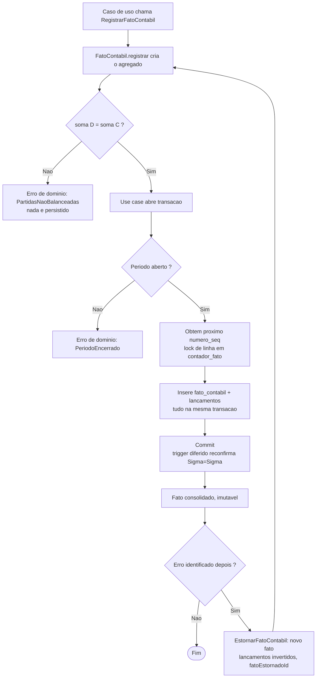

# Motor de partidas dobradas (domínio do razão)

[← Arquitetura técnica](./README.md) · [Schema do razão (DDL)](./razao-contabil-schema.md) · [Modelo de dados](../10-modelo-dados.md) · [Regras de negócio](../05-regras-de-negocio.md)

> Design do **domínio/aplicação** (Kotlin/Java, monólito modular — [ADR-0002](./adr/0002-monolito-modular.md)) que opera as travas do [schema do razão](./razao-contabil-schema.md): agregado `FatoContabil`/`Lancamento`, invariante Σdébito=Σcrédito **verificada na aplicação** antes de persistir (Regra 8 — [05-regras-de-negócio](../05-regras-de-negocio.md)), numeração sequencial cronológica gapless, saldo **derivado** ([ADR-0007](./adr/0007-read-models-cqrs.md)) e correção só por estorno. O DDL já trava isso no banco (defesa em profundidade); este doc é a contraparte que o guardião de arquitetura cobra do código (`domain/application/infra`).

## O que é e base legal

O razão contábil de dupla entrada é o núcleo do SIAFIC ([10-modelo-dados](../10-modelo-dados.md#razão-contábil-núcleo)): todo evento de execução é escriturado como um **fato contábil** que gera **lançamentos** balanceados sobre contas do PCASP. Base legal: LRF (LC 101/2000) art. 50 §2º, Lei 4.320/1964 art. 85, Portaria STN vigente (MCASP/PCASP) — **revalidar na fonte oficial** antes de fechar qualquer trava em código.

**Regra 8** ([05-regras-de-negócio](../05-regras-de-negocio.md)) é explícita: as travas físicas (não-negatividade de saldo, unicidade da numeração, bloqueio de escrita, revogação de UPDATE/DELETE) são reforçadas no banco, mas **"a invariante transacional de partidas dobradas soma(D)=soma(C) permanece na aplicação"**. Ou seja: o *constraint trigger* diferido do [schema](./razao-contabil-schema.md#trava-1--partidas-dobradas-σdébito--σcrédito-por-fato) é a rede de segurança; a verificação primária, que falha rápido antes de tocar o banco, é do agregado de domínio.

## O que PRECISO implementar

- **Agregado `FatoContabil`** (raiz) com `Lancamento` como membros internos (não é agregado próprio — não existe `Lancamento` sem `FatoContabil`). Factory `FatoContabil.registrar(...)` que:
  - Recebe a lista de lançamentos (conta, natureza D/C, valor) e **rejeita a construção** (erro de domínio, não `null`/booleano) se `soma(valor onde D) ≠ soma(valor onde C)` — verificação **na aplicação**, antes de qualquer I/O.
  - Rejeita lançamento com `valor <= 0` ou natureza fora de `{D,C}` — mesma trava do `check` no banco, espelhada no VO.
  - Usa `BigDecimal`/`NUMERIC(18,2)` em toda a cadeia — nunca `float`/`double` ([ADR-0006](./adr/0006-dinheiro-decimal.md)).
  - `dataHoraRegistro` vem de um `Clock` injetado (relógio do servidor) — nunca de input do cliente (anti-backdating, Regra 2).
  - Sem setters; sem métodos `atualizar`/`excluir` — fato consolidado é imutável (Regra 3/4).
- **Numeração sequencial cronológica gapless**: o próximo `numero_seq` é obtido do `contador_fato` (lock de linha, `UPDATE ... RETURNING`) **na mesma transação** do insert do fato e dos lançamentos — se a transação faz rollback, o incremento também desfaz (sem buraco). Isso é responsabilidade do **use case** (`application`), não do agregado (que não sabe de banco) — ver [schema §numeração](./razao-contabil-schema.md#numeração-sequencial-cronológica-gapless).
- **Verificação de período aberto** antes de registrar: use case consulta `PeriodoContabilPort`; período `encerrado` rejeita o registro (Regra 5) com erro de domínio específico.
- **Persistência atômica do fato**: o repositório insere `fato_contabil` + todos os `lancamento` do fato **numa única transação, tudo ou nada** — isto é o razão, não a borda; **fail-soft do ADR-0013 não se aplica aqui** (unidade de atomicidade é o fato inteiro, partidas dobradas parciais são proibidas).
- **Correção por estorno**: novo caso de uso `EstornarFatoContabil` que cria um **novo** `FatoContabil` com `fatoEstornadoId` apontando ao original, contendo lançamentos com natureza invertida (D↔C) que neutralizam o efeito líquido — nunca `UPDATE`/`DELETE` no original. O estorno em si também precisa fechar Σ=Σ (é só mais um fato).
- **Saldo como read-model derivado** ([ADR-0007](./adr/0007-read-models-cqrs.md)): porta de consulta (`ConsultaSaldoPort`) que lê de `saldo_conta` (view) ou de uma projeção materializada reconstruível — nunca uma tabela de saldo tratada como fonte da verdade. Consistência eventual aceitável dentro do SLA do ADR-0007.
- **Ports na `application`, sem vazamento de infra**: `FatoContabilRepository` (só `inserir`/`buscarPor...`, **sem** `atualizar`/`excluir` na assinatura — proibir no nível do tipo, não só por convenção), `ContadorFatoPort`, `PeriodoContabilPort`, `RelogioPort` (ou `java.time.Clock` direto), `ConsultaSaldoPort`.

## O que NÃO preciso implementar (fora de escopo / delegável)

- **Scaffold Gradle/Spring Boot/Flyway** — [RAZ-1]. Pré-requisito físico para este código existir/compilar; não é parte desta issue.
- **DDL/migration do schema físico** (tabelas, triggers, RLS) — já desenhado em [razao-contabil-schema.md](./razao-contabil-schema.md) ([RAZ-3]); este doc consome esse contrato, não o redefine.
- **Execução da despesa/receita** (`Empenho`, `Liquidação`, `Pagamento`) — módulos que **produzem** fatos contábeis chamando este motor; não fazem parte do motor em si.
- **Trilha de auditoria WORM/hash-chain** ([ADR-0005], [RAZ-6]) — store segregado; este doc só assume que cada fato/estorno é rastreável por ali.
- **RLS/isolamento multi-ente** ([ADR-0003]) — o motor assume que a transação já rodou `set local app.ente_id`; não implementa o `set` (isso é da borda HTTP/interceptor, [RAZ-5]).
- **Outbox/publicação do evento "fato registrado"** ([ADR-0004], [RAZ-9]) — efeito externo é assíncrono, fora da transação do razão.

## Como integrar (build × integrate)

- **Construir**: agregado `FatoContabil`/`Lancamento`, use cases `RegistrarFatoContabil`/`EstornarFatoContabil`, ports do parágrafo acima, adapter Postgres do repositório (batch insert dos lançamentos numa única `PreparedStatement` em lote, mas atômico — não fail-soft) e do contador (`SELECT ... FOR UPDATE`/`UPDATE ... RETURNING`).
- **Reutilizar**: `Clock` do Spring, transação declarativa (`@Transactional`) para amarrar contador + fato + lançamentos numa única unidade; o *constraint trigger* diferido do banco continua ativo como defesa em profundidade (não removI-lo por já validar na aplicação).

## Fluxo

## Faseamento

| Fase | Entrega |
| --- | --- |
| **F0** | Este design (agregado, ports, fluxo) — feito **antes** do scaffold existir, para não bloquear o desenho enquanto [RAZ-1]/[RAZ-3] avançam em paralelo. |
| **F1** | Implementação Kotlin (`domain/application/infra` do módulo `razao`) assim que o scaffold Gradle ([RAZ-1]) e a migration Flyway do schema ([RAZ-3]) existirem; testes de integração dos 6 cenários de [stress test do schema](./razao-contabil-schema.md#como-o-guardião-testa-isto). |
| **F2** | `EstornarFatoContabil` + read-model de saldo materializado (se a leitura direta da view não escalar) — reconstruível, nunca fonte da verdade. |

## Dependências e status desta issue

Esta issue (**RAZ-4**) especifica o domínio; a implementação Kotlin real (`src/`) depende de:

- **[RAZ-1] Scaffold JVM (Spring Boot + Gradle + Flyway)** — sem módulo/build, não há onde colocar `domain/application/infra` nem como compilar/testar.
- **[RAZ-3] Schema do razão (as 4 travas)** — o use case e o adapter Postgres implementam contra esse DDL; a migration precisa existir para rodar os testes de integração das travas.

Sem `src/` ainda ([guardiao-arquitetura §Estado](../../.claude/agents/guardiao-arquitetura.md)), este documento é a entrega possível do heartbeat atual; o código nasce assim que os dois pré-requisitos acima estiverem consolidados.

## Fontes

- [Schema do razão (DDL + travas)](./razao-contabil-schema.md)
- [10 · Modelo de dados — Razão contábil (núcleo)](../10-modelo-dados.md#razão-contábil-núcleo)
- [05 · Regras de negócio](../05-regras-de-negocio.md) (Regras 1, 2, 3, 4, 5, 8)
- [04 · Fluxo 4 — Escrituração e correção por estorno](../04-fluxos.md#4-escrituração-e-correção-por-estorno)
- [ADR-0002 Monólito modular](./adr/0002-monolito-modular.md) · [ADR-0006 Dinheiro decimal](./adr/0006-dinheiro-decimal.md) · [ADR-0007 Read models/CQRS](./adr/0007-read-models-cqrs.md) · [ADR-0013 Persistência em lote fail-soft](./adr/0013-persistencia-lote-fail-soft.md)

---

[← Arquitetura técnica](./README.md) · [Schema do razão](./razao-contabil-schema.md) · [Modelo de dados](../10-modelo-dados.md) · [ADRs](./adr/)
