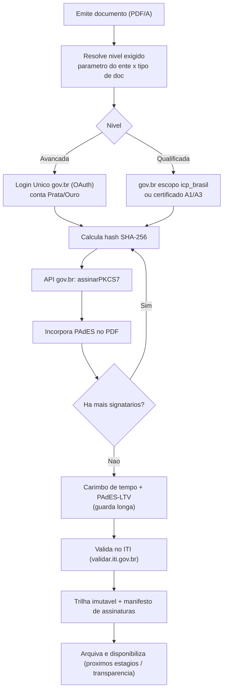

# Transversal · Assinatura eletrônica

[← Índice](../README.md) · [Plataforma e transversais](../11-plataforma-transversal.md)

> Assinar empenhos, contratos, portarias e ordens bancárias com **validade jurídica**, sem construir criptografia própria. Estratégia: **serviço único de assinatura com provedores plugáveis**, tendo a **API gov.br** como base.

## Base legal e tipos

- **MP 2.200-2/2001** — institui a **ICP-Brasil** (ITI como AC-Raiz); art. 10, §1º dá **presunção de veracidade** à assinatura com certificado ICP-Brasil.
- **Lei 14.063/2020** — organiza a assinatura eletrônica nas interações com o poder público; define os 3 tipos (art. 4º) e o nível mínimo por tipo de ato (art. 5º).
- **Decreto 10.543/2020** — regulamenta níveis mínimos no âmbito federal; estados/municípios fixam o nível **por ato do titular do Poder/órgão**.

| Tipo | Como se materializa | Presunção legal |
| --- | --- | --- |
| **Simples** | Login/senha, conta gov.br **Bronze** | Válida; ônus da prova de quem alega |
| **Avançada** | **Assinador gov.br** (conta Prata/Ouro), certificados corporativos, ICP-Edu | Válida; sem presunção automática |
| **Qualificada** | **Certificado ICP-Brasil** (A1/A3, inclusive em nuvem) | **Presunção de veracidade** plena |

**Regra de nível (art. 5º, §2º):** a **qualificada** é obrigatória para atos de **chefe de Poder/Ministro/titular de órgão autônomo**, **NF-e** e **transferência/registro de imóveis**. A **nota de empenho** costuma ser assinada pelo **ordenador de despesa** — logo **não cai automaticamente** na obrigatoriedade de qualificada; o nível é o que o **ente definir**. Por isso o produto **parametriza o nível por ente × tipo de documento**.

## O que o produto precisa (ao longo das fases)

> Esta lista é a **união das fases** (F0+F1+F2), não o escopo do MVP. Cada item traz o sufixo `[F0]`/`[F1]`/`[F2]` indicando a fase em que entra, coerente com a tabela de **Faseamento**.

1. Geração do documento em **PDF/A** + cálculo de **hash SHA-256** do conteúdo a assinar. **[F0]**
2. Integração com **pelo menos um provedor** (mínimo: **API de Assinatura gov.br** — avançada). **[F0]**
3. Formato **PAdES** (assinatura embarcada no PDF) como principal; suporte a `.p7s`/**CAdES** destacado quando necessário. **[F0]** (coerente com a tabela de Faseamento e o javadoc de `DocumentoAssinado`; RAZ-34 implementa a incorporação PAdES do PKCS#7 via byte-range + dicionário `/Sig`, ISO 32000)
4. Suporte à **qualificada ICP-Brasil** (via `icp_brasil` do gov.br / A1/A3) para o subconjunto obrigatório. **[F1]**
5. **Parametrização do nível mínimo por ente × tipo de documento** (não "chumbar" um nível único). **[F0]**
6. **Verificação de elegibilidade** antes de assinar (rejeitar conta Bronze quando se exige avançada; validar cadeia do certificado) **e checagem do status de revogação do certificado (OCSP e/ou LCR/CRL) no ato da assinatura**, registrando o resultado na trilha. **[F0]**
7. **Workflow de múltiplas assinaturas por papel** (ex.: ordenador + responsável da UG; contratante/contratada/testemunhas). **[F1]**
8. **Manifesto de assinaturas** + carimbo visual (quem, CPF/cargo, data-hora, tipo, hash, link de verificação). **[F0]**
9. **Trilha imutável** e não-repudiável (signatário, timestamp, origem, tipo/nível, hash antes/depois, id da transação). **[F0]**
10. **Validação da assinatura** na consulta (integridade + cadeia + **verificação do status de revogação via OCSP e/ou LCR/CRL**), registrando o resultado na trilha; o **Validador do ITI** (`validar.iti.gov.br`) é a referência oficial, mas a checagem em tempo de assinatura **não depende só dele**. O não-repúdio se apoia na **MP 2.200-2/2001** e na **Lei 14.063/2020**. **[F1]**
11. **Carimbo de tempo + PAdES-LTV** para documentos de guarda longa, **incorporando as informações de revogação/carimbo (OCSP/CRL) ao PAdES-LTV** para permitir validação de longo prazo mesmo após a **expiração do certificado**. **[F1]**

A correção de um documento já assinado (ex.: nota de empenho) segue **estorno + novo documento assinado**, preservando o original íntegro (coerente com as regras 3 e 4). O artefato assinado é persistido na entidade **DOCUMENTO_ASSINADO** (`id`, `tipo`, `hash`, `formato`, `id_transacao`, `manifesto`, dados de revogação/carimbo LTV, `uri_blob`), ancorada por **FK ao EMPENHO/CONTRATO/OB** no modelo de dados, e armazenada no **GED/object store** da plataforma (cifrado em repouso, coberto pelo backup seguro).

## O que NÃO preciso implementar

- **Autoridade Certificadora própria / emissão de certificados** → consumir ACs da ICP-Brasil.
- **Identidade/login do signatário** → usar **Login Único gov.br** (OAuth); sem base de identidade nem prova de vida.
- **Motor criptográfico de assinatura avançada** → usar a **API gov.br**.
- **HSM / guarda do certificado em nuvem** → responsabilidade do **PSC** da ICP-Brasil.
- **Autoridade de Carimbo do Tempo** → usar **ACT credenciada**.
- **Validador nacional** → usar o **Validador do ITI** (`validar.iti.gov.br`) como fonte oficial.
- **Tokens/leitoras A3 e drivers** → fornecidos pelo signatário/PSC.
- **Assinatura XAdES de NF-e** → é da SEFAZ/emissor fiscal, fora do núcleo.

## Como integrar (build × integrate)

- **Base recomendada:** **API de Assinatura gov.br** como camada única — **avançada** (conta Prata/Ouro) para o grosso dos documentos e **qualificada** (`icp_brasil`, certificado em nuvem) para o subconjunto obrigatório. Saída padronizada em **PAdES/PDF**.
- **OAuth 2.0** com escopos `sign` (uso único) / `signature_session` (lote); o app calcula o hash e chama `assinarPKCS7`.
- **Construir** apenas: a **abstração de provedor** (interface única, provedores plugáveis: gov.br-avançada, gov.br-qualificada, A1/A3 local), o workflow multi-assinatura, o manifesto e a trilha.
- **Certificado em nuvem** (A3 em nuvem via PSC) é o caminho de **menor fricção** (dispensa token físico).

## Fluxo — assinar uma nota de empenho

## Faseamento

| Fase | Entrega |
| --- | --- |
| **F0** | Provedor único **gov.br (avançada)**; saída PAdES/PDF; trilha + manifesto; parametrização de nível por tipo; rejeição de conta Bronze; **checagem de revogação (OCSP/CRL) no ato da assinatura e na validação**, registrada na trilha |
| **F1** | **Qualificada ICP-Brasil** (`icp_brasil`/nuvem) para chefes de Poder e contratos; workflow multi-assinatura; carimbo de tempo + PAdES-LTV com **OCSP/CRL embutidos**; validação via ITI |
| **F2** | Suporte a **A1/A3 local** (token/desktop); **assinatura em lote**; CAdES/XAdES sob demanda; verificação automatizada DOC-ICP-15 |

## Fontes

- Lei 14.063/2020 · Decreto 10.543/2020 · MP 2.200-2/2001 — planalto.gov.br
- Assinatura eletrônica gov.br — `gov.br/governodigital/.../assinatura-eletronica`
- Manual de Integração da Assinatura gov.br — `manual-integracao-assinatura-eletronica.servicos.gov.br`
- ITI — DOC-ICP-15; Validador `validar.iti.gov.br`

> Ressalva: níveis de conta gov.br (Bronze/Prata/Ouro) e escopos evoluem por atos infralegais da SGD/MGI; confirmar a versão vigente do manual na implementação.

---

[Índice](../README.md) · [PNCP →](./02-pncp.md)
