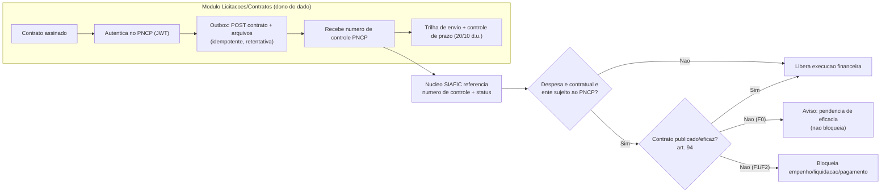

# Transversal · Integração ao PNCP

[← Índice](../README.md) · [Plataforma e transversais](../11-plataforma-transversal.md)

> **Decisão de escopo:** a publicação no **PNCP** é do **módulo de licitações/contratos** (estruturante), **não do núcleo SIAFIC**. O núcleo apenas **referencia o número de controle PNCP** e, no F0, **avisa** (sem bloquear) sobre a eficácia do contrato (art. 94) na despesa contratual; o **bloqueio** só entra em F1/F2, condicionado à reconciliação/integração com o módulo licitações. **Não bloqueia o MVP do núcleo.**

## Base legal

- **Lei 14.133/2021, art. 174** — cria o PNCP para **divulgação centralizada e obrigatória** dos atos de contratação; §2º lista o que consta: PCA, editais/avisos e anexos, atas de registro de preços, contratos e aditivos, NF-e quando for o caso.
- **Art. 54** — publicidade do edital pelo **inteiro teor no PNCP**; prazo de propostas conta da divulgação no PNCP.
- **Art. 94** — **a divulgação no PNCP é condição de eficácia** do contrato e aditamentos. Prazos da assinatura: **20 dias úteis** (licitação) / **10 dias úteis** (contratação direta). **Contrato não publicado não produz efeitos** (não executa/paga).
- **Art. 12, §1º** + Decreto 10.947/2022 — **PCA** divulgado no PNCP.
- **Art. 176** — transição estendida para municípios ≤ 20.000 hab. (confirmar por ente).

## O que PRECISO implementar

**No módulo licitações/contratos** (dono do dado):

1. **Motor de publicação outbound** para PCA, editais/avisos, itens, atas, contratos, aditivos e arquivos.
2. **Autenticação JWT** (login do usuário-sistema do ente) com renovação automática e cofre de credenciais.
3. **Mapeamento para os schemas do PNCP** (tabelas de domínio: modalidade, amparo legal, unidade compradora…).
4. **Upload de arquivos** (edital/minuta/contrato em PDF) via multipart.
5. **Captura e persistência do número de controle PNCP** (`CNPJ-1-NNNNNN/AAAA`).
6. **Controle de prazos** (20/10 dias úteis) com alertas.
7. **Trilha de envio** (payload, resposta, status, timestamp) + **outbox idempotente** com retentativa.
8. Ciclo completo por objeto: **inclusão, retificação (PUT), exclusão/anulação (DELETE)**.
9. **Ambiente de homologação** parametrizável (`treina.pncp.gov.br`).

**No núcleo SIAFIC** (mínimo, F0):

- **Referenciar o número de controle PNCP** no cadastro de contrato + **aviso** (não bloqueio) no F0.
- **Aviso de eficácia** (não bloqueante): sinalizar quando a **despesa vinculada a contrato sujeito ao art. 94/PNCP** ainda não tem publicação confirmada. A trava **não** atinge todo empenho — **não bloquear** folha, diárias ou despesas sem contrato formal. Parametrizável **por ente** e **por vigência** (respeitando o art. 176, que atinge municípios ≤ 20.000 hab. — o segmento-alvo). O **bloqueio** propriamente dito só entra em F1/F2 (ver Faseamento).
- **Sincronização do status de eficácia**: a entidade **CONTRATO** (referência no núcleo) recebe os campos **numero_controle_pncp** e **status_eficacia** via **evento do publisher** (propriedade do módulo licitações), com **reconciliação pela API de Consulta**, guardando o estado e o **timestamp da última verificação**. Quando o status **ainda não chegou**, o comportamento é **pendência** (aviso), **não bloqueio**. Esses campos refletem-se em CONTRATO no [modelo de dados (10)](../10-modelo-dados.md).

## O que NÃO preciso implementar (no núcleo)

- Publicar **editais, avisos, atas, contratos, aditivos, PCA, catálogos ou NF-e** no PNCP — tudo isso é do **módulo de licitações/contratos**.
- Gerar/hospedar os **documentos** de licitação (PDF de edital, minuta).
- Se o produto for **só o núcleo**, a publicação é **delegável ao sistema de licitações do ente** — implementa-se apenas o **consumo do número de controle** e o gate de eficácia.

## Como integrar (build × integrate)

- **Duas APIs do PNCP:** **Consulta** (pública, sem auth — reconciliação) e **Integração/Manutenção** (autenticada — publicação). Homologação em `treina.pncp.gov.br`.
- **Sem SDK oficial** → REST direto. **Construir** o publisher resiliente (auth/renovação de token, mapeadores, outbox idempotente, retentativa, trilha). **Reutilizar** as **tabelas de domínio/schemas** oficiais e a **API de Consulta** para verificar o que foi publicado.
- Tratar as **tabelas de domínio como configuração externa** (a série 2.x da API evolui).

## Fluxo — publicar um contrato + gate no núcleo

## Faseamento

| Fase | Entrega |
| --- | --- |
| **F0** | **Núcleo:** referenciar número de controle PNCP + **aviso de eficácia não bloqueante** (art. 94), escopado à despesa contratual e parametrizável por ente/vigência. Definir a fronteira de dados (dono do contrato) |
| **F1** | **Módulo licitações:** publisher outbound de **contratos e aditivos** (JWT, outbox, idempotência, retentativa, trilha); homologação; painel de status e alertas de prazo. **Gate de eficácia BLOQUEANTE** no núcleo, condicionado à integração com o módulo licitações que forneça o status |
| **F2** | Publicação de **editais/avisos, itens, resultados, atas e PCA**; retificações/anulações; **reconciliação via API de Consulta** (base do gate bloqueante); relatórios de conformidade |

## Fontes

- Lei 14.133/2021 (arts. 54, 94, 174) — planalto.gov.br
- PNCP — `gov.br/pncp`; Manual de Integração + Swagger (`pncp.gov.br/api/pncp/swagger-ui`)
- Prazos de divulgação — TCU (`licitacoesecontratos.tcu.gov.br`)
- Decreto 10.540/2020 (SIAFIC × estruturantes) — planalto.gov.br

> Ressalva: paths e schemas dos endpoints de manutenção evoluem entre versões — confirmar no Manual/Swagger vigente. Regra de transição do art. 176 deve ser checada para o ente-cliente.

---

[← Assinatura eletrônica](./01-assinatura-eletronica.md) · [Índice](../README.md) · [Transparência →](./03-transparencia.md)
