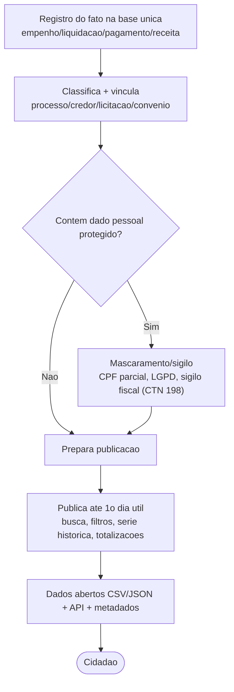

# Transversal · Transparência ativa

[← Índice](../README.md) · [Plataforma e transversais](../11-plataforma-transversal.md)

> **É núcleo do produto** (build): o Portal da Transparência derivado da base única, publicando cada fato **até o 1º dia útil subsequente ao registro**. Complementa o [Fluxo 9](../04-fluxos.md#9-transparência-em-tempo-real).

## Base legal

- **LRF, art. 48 e 48-A** (incluídos pela **LC 131/2009**) — acompanhamento **em tempo real** da execução; despesa (nº do processo, bem/serviço, **credor CPF/CNPJ**, licitação) e receita (lançamento e recebimento).
- **Decreto 10.540/2020, art. 3º** — define **tempo real** = disponibilização **até o 1º dia útil subsequente ao registro contábil** (revogou o Decreto 7.185/2010 a partir de 01/01/2023). **Este é o SLA-alvo.**
- **LAI (Lei 12.527/2011), art. 8º** — divulgação ativa mínima; busca, **formatos abertos legíveis por máquina** (dados abertos), acessibilidade.
- **Lei 14.129/2021** — política de dados abertos (formato aberto, metadados, licença livre).
- Sanção: **LRF art. 73-C (c/c art. 73-B)**, que sujeita quem não implanta a transparência do art. 48, §1º e do art. 48-A à sanção do **art. 23, §3º, I** — impedimento de receber transferências voluntárias.

## O que PRECISO implementar

**Conteúdo mínimo do portal:**

- **Despesa** — empenho/liquidação/pagamento com processo, classificação orçamentária, **credor CPF/CNPJ**, licitação/dispensa, descrição do bem/serviço, convênio quando houver.
- **Receita** — previsão, lançamento, arrecadação, recolhimento, com classificação.
- **Licitações e contratos** — objeto, modalidade, valor, vigência, contratado (consumindo o **PNCP** — ver [spec PNCP](./02-pncp.md)).
- **Convênios e transferências**, **diárias e passagens**, **servidores/remuneração individualizada** (STF Tema 483 — ver [LGPD](./04-lgpd.md)).
- **Instrumentos LRF** — PPA/LDO/LOA, créditos, **RREO** (bimestral), **RGF** (quadri/semestral), parecer prévio do TCE.

**Funcionais e de formato:**

- **Dados abertos**: exportação/consulta em **CSV e JSON**, acesso automatizado por API, download de bases completas, **dicionário de dados/metadados**.
- **Busca e filtros** (credor, órgão, período, função, nº de empenho/contrato); ordenação; paginação.
- **Série histórica** consultável (nunca sobrescrever).
- Consulta **sem cadastro**, gratuita, com totalizações e detalhamento até o documento.
- **SLA**: publicação **≤ 1º dia útil** após o registro; instrumentos LRF nos prazos próprios.
- **Integridade/autenticidade** e carimbo de última atualização.
- **Mascaramento uniforme em todos os canais**: a biblioteca única de mascaramento/anonimização (spec LGPD) é aplicada uniformemente a TODOS os canais de saída pública — HTML, CSV, JSON, API e download de bases — com teste de regressão que **falha o build** se um canal público vazar campo não-mascarado. O acesso interno autorizado vê o dado íntegro sob RBAC + log de leitura. Formato canônico de máscara de CPF minimizando dígitos expostos (ver [spec LGPD](./04-lgpd.md)).
- **Controles de borda** que preservem a disponibilidade (**Decreto 10.540 art. 9º**) e reduzam extração massiva para re-identificação, **sem exigir cadastro nem bloquear download legítimo**: rate limiting e quotas por cliente/IP na API, cache/CDN para absorver picos, proteção anti-DDoS/WAF e monitoração de scraping; servir o bulk por arquivo/CDN versionado em vez de varredura da API. F0/F1: rate limiting + CDN; com o download de bases: anti-scraping e quotas.

## O que NÃO preciso implementar (delegável / integrar)

- **e-SIC (transparência passiva)** — sistema separado (ex.: **Fala.BR**); o portal apenas **aponta**.
- **Ouvidoria** (Lei 13.460/2017) e **carta de serviços** — módulos à parte.
- **Conteúdo institucional** (organograma, legislação, FAQ) — CMS/portal institucional.
- **Licitações/contratos como fonte primária** — divulgação oficial é no **PNCP**; consumir/referenciar.
- **Monitoramento físico de obras** e **cálculo de folha** — sistemas próprios; o SIAFIC entrega o lado financeiro.
- **Acessibilidade** — obrigatória, mas é spec própria (ver [Acessibilidade](./05-acessibilidade.md)).

## Como integrar (build × integrate)

- **Construir**: base única (fonte da verdade) → **pipeline de publicação incremental orientado a evento** (gatilho no registro contábil, não carga manual) → módulo Portal + **camada de dados abertos/API**.
- **Integrar/apontar**: **PNCP**, **SICONFI/MSC**, **TCE**, **e-SIC/Fala.BR**, **Ouvidoria**, **CMS institucional** (link/SSO).

## Fluxo — do registro à publicação

## Faseamento

| Fase | Entrega |
| --- | --- |
| **F0** | Base única + pipeline no SLA; **despesa e receita** (LRF 48-A); busca/filtros básicos; série histórica; instrumentos LRF; **mascaramento de CPF e regra de folha** (não vai ao ar sem isto) |
| **F1** | Licitações/contratos (via PNCP), convênios, diárias; **remuneração individualizada** condicionada à disponibilidade da integração com a folha (sistema estruturante — F2 no roadmap) OU a carga manual/CSV de contingência no MVP; **CSV/JSON + API + dicionário de dados**; acessibilidade; links e-SIC/Ouvidoria |
| **F2** | Painéis analíticos, downloads de bases, versionamento de dados abertos, integração fina SICONFI/MSC e TCE; alinhar aos critérios da **EBT 360 (CGU)** |

> Dependência cruzada: a entrega **remuneração individualizada** (F1) depende da integração com a folha, sistema estruturante entregue na mesma fase da integração (F2 no roadmap); no MVP, supri-la por carga manual/CSV de contingência. Cruza com o [Fluxo 5](../04-fluxos.md#5-integração-com-sistemas-estruturantes).

## Fontes

- LRF art. 48/48-A · LC 131/2009 · LAI 12.527/2011 · Lei 14.129/2021 — planalto.gov.br
- Decreto 10.540/2020, art. 3º (tempo real) — planalto.gov.br
- CGU — Escala Brasil Transparente 360 e Guia de Transparência Ativa (`gov.br/cgu`)

> Ressalva: revalidar o texto literal dos arts. 7º/8º do Decreto 10.540/2020 e do art. 8º da LAI na fonte oficial antes de fechar a especificação.

---

[← PNCP](./02-pncp.md) · [Índice](../README.md) · [LGPD →](./04-lgpd.md)
