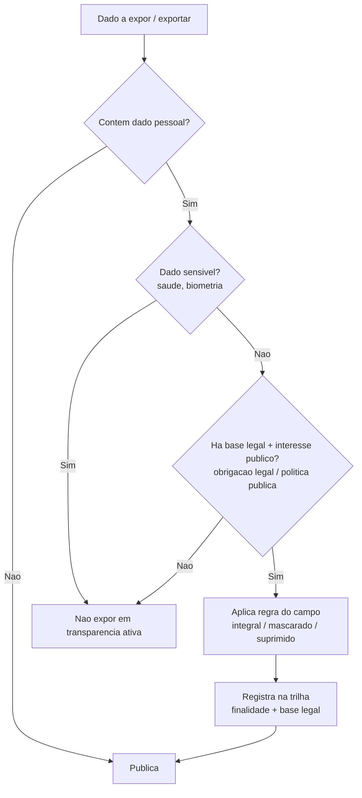

# Transversal · LGPD

[← Índice](../README.md) · [Plataforma e transversais](../11-plataforma-transversal.md)

> LGPD no SIAFIC = **minimização + controle de acesso + auditoria + mascaramento na transparência**, com **base legal de obrigação legal / política pública (nunca consentimento)**. As capacidades técnicas são do produto; **DPO, RIPD e governança são do ente**.

## Base legal

- **LGPD (Lei 13.709/2018), arts. 23–30** — tratamento pelo **poder público**. O ente é **controlador**; o fornecedor do software é **operador** (art. 5º, VI/VII).
- **Bases legais aplicáveis** (não é consentimento): **art. 7º, III** (execução de políticas públicas) e **art. 7º, II** (cumprimento de obrigação legal — escrituração, publicação, prestação de contas). Dados **sensíveis**: **art. 11, II, "a"/"b"**.
- **Princípios (art. 6º)**: finalidade, adequação, **necessidade/minimização**, segurança, **responsabilização** (demonstrar conformidade).
- **STF Tema 483 / ARE 652777** — remuneração nominal de servidor **pode** ser divulgada; **CPF, RG e endereço não**.
- **Sigilo fiscal (CTN, art. 198)** — dado de arrecadação de contribuinte não vai à transparência ativa.

## O que PRECISO implementar

1. **RBAC / controle de acesso** (art. 46) — perfis por papel, **privilégio mínimo**, revisão periódica. **Matriz de segregação de funções** (lança ≠ autoriza ≠ paga) com **enforcement preventivo** — veto a auto-aprovação e a acúmulo de papéis conflitantes. **MFA para perfis privilegiados** (ordenador, tesouraria, administradores, acessos privilegiados) é **F0** — aceitando **ICP-Brasil ou gov.br Prata/Ouro** como fator forte, fundamentado em proporcionalidade ao risco (art. 46); **MFA generalizado** em fase posterior.
2. **Minimização por design** (art. 6º, III) — telas/relatórios/exports só com os campos necessários; nada de "puxar a tabela inteira".
3. **Registro de tratamento** (art. 37) — suporte ao **ROPA** (inventário: dado, finalidade, base legal, retenção, compartilhamentos) + **trilha imutável** de acesso/alteração de dado pessoal.
4. **Base legal amarrada à operação** — cada operação/relatório declara **finalidade + base legal** (metadado configurável; em regra art. 7º, II/III).
5. **Segurança / gestão de incidentes** (arts. 46–49) — **TLS em tudo**, **criptografia em repouso** de sensíveis/credenciais, backup. **Cofre de segredos** e **cifragem em repouso de credenciais de integração e de dados bancários**; **algoritmo de hashing de senha** explícito (**Argon2id/bcrypt/scrypt com salt**, não apenas "hash"); **gestão de chaves** com separação chave×dado, custódia distinta do DBA e proibição de chaves em código/config. No F0, o cofre é o port único com passthrough de ambiente/secret file da esteira ([ADR-0024](../arquitetura-tecnica/adr/0024-cofre-segredos-f0-env-passthrough.md)); KMS/HSM gerenciado, rotação automática e auditoria nativa do provedor escalam por fase/tier. Gestão de incidentes: definir **taxonomia de eventos de segurança e limiares de alerta**; **detecção/alerta de acessos e operações anômalas** (fora de alçada, volume, horário); gerar automaticamente o **pacote de evidências** (linha do tempo, titulares potencialmente afetados, logs) para o ente cumprir a comunicação à ANPD no prazo de **3 dias úteis da Resolução CD/ANPD nº 15/2024** — o produto **NÃO comunica à ANPD** (ato do controlador, art. 48), apenas entrega evidências e alerta tempestivo; documentar **runbook mínimo de contenção** (revogar credencial, isolar origem de ingestão comprometida).
6. **Retenção e eliminação** (arts. 15/16) — política **configurável** respeitando a guarda contábil/fiscal; ao fim do prazo, **eliminação ou anonimização** registrada. Conciliação com a imutabilidade do razão (fluxo 4): os identificadores pessoais (CPF, nome, endereço, dados bancários) vivem segregados/tokenizados em cofre cifrado, referenciados por chave a partir do lançamento imutável. Ao fim da guarda contábil/fiscal e do prazo prescricional aplicável (LGPD art. 16, I — a obrigação legal prevalece; não se elimina no prazo genérico da LGPD), anonimiza-se/elimina-se a entrada do cofre SEM alterar o lançamento (valor, classificação e vínculo preservados). Documentar o inventário de campos em três classes — elimináveis, de guarda temporária (até a prescrição) e de guarda perpétua contábil — e registrar a eliminação/anonimização na trilha imutável.
7. **Direitos do titular** (art. 18) — meios técnicos para **consulta e correção** (no setor público, oposição/eliminação são limitadas pela base legal).
8. **Mascaramento / regras de exposição** — ver tabela abaixo; **mascaramento é o default**.
9. **Insumos para RIPD/DPIA** (arts. 5º, XVII e 38) — mapa de fluxos, finalidades, riscos, medidas.

### Regra de exposição no portal

| PODE expor (transparência ativa) | NÃO expor / mascarar |
| --- | --- |
| Nome, cargo, lotação, **remuneração nominal** (STF Tema 483) | **CPF** (mascarar expondo no máximo 3 dígitos centrais: `***.456.***-**`), **RG**, endereço |
| Razão social / **CNPJ** de fornecedor | Dados **bancários**, telefone pessoal, dependentes |
| Empenho/liquidação/pagamento, nº de contrato/licitação | Dados **sensíveis** (saúde, biometria) |
| — | Dado sob **sigilo fiscal** (CTN 198) — publicar agregado |

> Formato canônico da máscara de CPF: `***.456.***-**` (no máximo 3 dígitos centrais). Expor 6 dígitos centrais (`***.456.789-**`), cruzado com o nome público (STF Tema 483), facilita a **reconstrução do número completo** — os dois primeiros grupos e o dígito verificador tornam-se dedutíveis.

## O que NÃO preciso implementar (é do ente)

- **Encarregado/DPO** (arts. 23, III e 41) — indicação e atuação são do **ente**; o produto só exibe o contato.
- **Consentimento como base legal** — **não** implementar fluxos de consentimento como base padrão (erro jurídico no setor público).
- **e-SIC / atendimento ao titular** — processo do órgão; o produto **fornece os dados**.
- **RIPD, ROPA aprovado, PSI, treinamento** — decisão e governança do ente.
- **Comunicação de incidente à ANPD** (art. 48) — ato do controlador; o produto entrega detecção/logs/evidências.

## Como integrar (build × integrate)

Tratar LGPD como **serviços de plataforma** (build uma vez, consumido por todos os módulos):

- **IAM** (autenticação SSO/gov.br ou LDAP do ente, MFA, motor RBAC/ABAC central).
- **Serviço de criptografia/segredos** (TLS gerenciado, repouso) — usa o **padrão único de cofre/rotação/escopo mínimo** definido na plataforma ([Plataforma e transversais](../11-plataforma-transversal.md)) para as contas de serviço de alto privilégio (gov.br sign, PNCP publish, banco, SICONFI, TCE), em vez de descrever "cofre" pontualmente.
- **Serviço de auditoria/logging** (trilha imutável central).
- **Serviço de mascaramento/anonimização** (biblioteca única usada por telas internas **e** portal/API).
- **Catálogo/inventário de dados (ROPA)** com classificação pessoal/sensível e base legal.

Princípio: **privacy/security by design (art. 46)** — o mascaramento é **por contexto/audiência, imposto na fronteira de exposição** (portal/API/export/relatório): público e API abertos sempre mascaram; papéis internos autorizados veem o dado íntegro sob RBAC + trilha de leitura. O núcleo NÃO esconde o identificador de si mesmo — o credor/beneficiário exige CPF/CNPJ íntegro no empenho e no pagamento (LRF art. 48-A; fluxo 2). A base única guarda o identificador íntegro **cifrado em repouso** (tokenizado na entidade PESSOA). O módulo consome os serviços transversais de mascaramento/auditoria, não grava log próprio.

## Fluxo — decisão de exposição de um dado

## Faseamento

| Fase | Entrega |
| --- | --- |
| **F0** | RBAC + segregação com enforcement preventivo; **MFA de perfis privilegiados** (ICP-Brasil / gov.br Prata-Ouro); **TLS em tudo**; **hash de senhas com Argon2id/bcrypt/scrypt + salt**; **cofre de segredos via port + passthrough de ambiente/secret file**; **cifragem em repouso de credenciais de integração e dados bancários**; gestão de chaves com separação chave×dado, custódia distinta do DBA e rotação manual/sob incidente; trilha de acesso/alteração; **detecção/alerta de acessos e operações anômalas** (fora de alçada, volume, horário); **mascaramento default** (CPF/RG/endereço/banco); base legal por operação; contato do encarregado. *Sem isto, reprova em auditoria TCE/ANPD* |
| **F1** | ROPA + classificação de campos; retenção/eliminação configurável; direitos do titular (consulta/correção); **cobertura ampla de criptografia em repouso**; KMS/Secrets Manager gerenciado quando exigido por tier; taxonomia de eventos e gestão de incidentes (pacote de evidências para ANPD, runbook de contenção); registro de compartilhamentos (SICONFI/TCE/bancos) |
| **F2** | Insumos para **RIPD/DPIA**; anonimização avançada (dados abertos e ambientes de teste); painel de governança; **MFA generalizado**; HSM dedicado/rotação automática para entes de maior risco |

## Fontes

- LGPD (Lei 13.709/2018) — planalto.gov.br
- ANPD — Guia "Tratamento de Dados Pessoais pelo Poder Público" e Guia de Segurança (`gov.br/anpd`)
- STF — Tema 483 / ARE 652777

> Ressalva: prazos de retenção contábil/fiscal variam por norma do ente/TCE — **parametrizáveis**, não fixos em código. Necessidade formal de RIPD depende de avaliação de risco e de exigência da ANPD.

---

[← Transparência](./03-transparencia.md) · [Índice](../README.md) · [Acessibilidade →](./05-acessibilidade.md)
