# Transversal · Acessibilidade digital

[← Índice](../README.md) · [Plataforma e transversais](../11-plataforma-transversal.md)

> **Alvo único para todo o time: WCAG 2.2 nível AA** (≙ **ABNT NBR 17225:2025** "Conformidade Regular"). Portal do cidadão em rigor alto; back-office focado nos fluxos críticos. Tratar como **propriedade da plataforma** (design system + gate de CI), não checklist por tela.

## Base legal e situação atual

- **Decreto 5.296/2004, art. 47** — marco fundador: acessibilidade obrigatória nos sítios da administração pública.
- **eMAG 3.1 (2014)** — modelo do governo baseado na **WCAG 2.0**; **não revogado, mas congelado** (sem atualização desde 2014).
- **LBI (Lei 13.146/2015), art. 63** — acessibilidade obrigatória "conforme as melhores práticas e diretrizes **internacionais**" (na prática, **WCAG**); §1º exige o **símbolo de acessibilidade**.
- **Lei 14.129/2021 (Governo Digital)** — acessibilidade como princípio estruturante.
- **ABNT NBR 17225:2025** *(novo e decisivo)* — 1ª norma técnica brasileira de acessibilidade web, baseada na **WCAG 2.2**; "Conformidade Regular" ≙ **WCAG 2.2 A + AA**.

**eMAG ou WCAG?** Para um produto novo (2025/2026): **mire WCAG 2.2 AA** — satisfaz LBI art. 63, Decreto 5.296, Lei 14.129 e a NBR 17225, e é retrocompatível com o eMAG (cuja ferramenta **ASES** segue útil).

## O que PRECISO implementar

**Portal do cidadão — WCAG 2.2 AA:**

- **Perceptível** — `alt` em imagens informativas; **contraste** ≥ 4.5:1 (texto) e ≥ 3:1 (UI/gráficos); cor não como único meio; **reflow**/zoom 200%; legendas em mídia.
- **Operável** — **navegação 100% por teclado** sem armadilha de foco; **foco visível**; **skip link**; títulos e **headings hierárquicos**; links com propósito claro; novos AA da 2.2 (**alvo 24×24px**, **autenticação acessível**, entrada redundante, foco não obscurecido).
- **Compreensível** — `lang="pt-BR"`; navegação consistente; **formulários com `label`, instruções e sugestão de correção de erros** (crítico nos filtros de consulta).
- **Robusto** — HTML semântico + **ARIA** correto (name/role/value); **mensagens de status** anunciadas a leitor de tela; testado com **NVDA**/VoiceOver.
- **gov.br** — **símbolo de acessibilidade**, **página de declaração de Acessibilidade** e **VLibras** embarcado.

**Back-office (servidores) — rigor focado:** WCAG 2.1 A/AA nos **fluxos críticos** (empenho/liquidação/pagamento, lançamentos, emissão de documentos): teclado, contraste AA, `label`, semântica, foco visível, leitor de tela. **Sem VLibras e sem AAA.**

## O que NÃO preciso implementar

- **Nível AAA** — não é obrigatório em lugar nenhum (nem o W3C recomenda como meta geral).
- **VLibras "do zero"** — é **widget pronto e gratuito do gov.br**; integrar, não construir.
- **Avaliador de acessibilidade próprio** — usar **ASES** (CGU) e **axe-core**.
- **VLibras no back-office** — servidor surdo é atendido por acomodação pontual.
- **Audiodescrição/legenda AAA** — só se houver vídeo (sistema é majoritariamente tabular).
- **App mobile nativo (NBR 17060)** — só se houver app; portal responsivo cobre a web.
- **Barras de acessibilidade caseiras** (aumentar fonte/alto contraste via JS próprio) — não são exigência; boa semântica + navegador resolvem.

## Como integrar (build × integrate)

- **Usar pronto:** **Design System gov.br** (`gov.br/ds`) — componentes e **tokens já acessíveis**; **VLibras**; **ASES** (avaliador oficial, gera evidência para auditoria/TCE); **axe-core** + Lighthouse/WAVE.
- **Construir:** design system interno acessível (se não adotar o gov.br), **componentes de dados do domínio** (tabelas de execução, gráficos com alternativa textual, filtros) e o **gate de CI**.
- Regra: **componentes e testes = usar pronto; tokens do domínio, glue e pipeline = construir.**
- **DS gov.br × diferencial de UX:** o gov.br DS é adotado como **base de tokens e componentes acessíveis** (piso WCAG 2.2 AA / eMAG / NBR 17225), sobre a qual se constrói uma **camada de tematização/UX própria** — acessibilidade é piso herdado, diferenciação é a camada superior. O piso legal é a conformidade WCAG/eMAG, não o DS especificamente (o DS é meio, não obrigação). Esta é uma decisão de plataforma de front-end, registrada também em [11-plataforma-transversal.md](../11-plataforma-transversal.md).

## Fluxo — acessibilidade no ciclo de desenvolvimento

```mermaid
flowchart LR
    A["Design tokens acessiveis<br/>contraste AA, foco visivel"] --> B["Componentes acessiveis<br/>gov.br DS: teclado + ARIA"]
    B --> C["Lint a11y no editor<br/>(lang, headings, label, alt)"]
    C --> D["CI: axe-core + Lighthouse<br/>falha build em violacao A/AA"]
    D --> E["ASES: relatorio de conformidade<br/>(evidencia p/ auditoria/TCE)"]
    E --> F["Auditoria manual: teclado + NVDA<br/>jornadas criticas"]
    F --> G["Portal: VLibras + simbolo + declaracao"]
    G --> H["Regressao a cada release"]
```

## Faseamento

| Fase | Entrega |
| --- | --- |
| **F0** | Adotar **Design System gov.br**; semântica, `lang`, headings, skip link, foco, **teclado**, **contraste AA**, `alt`, **formulários com label + erros**; **VLibras + símbolo + declaração**; rodar **ASES + axe** e corrigir bloqueadores |
| **F1** | **axe-core como gate no CI** + budget Lighthouse; **auditoria manual com NVDA** (jornadas do cidadão + fluxos críticos do back-office); mensagens de status ARIA; alternativa textual para gráficos |
| **F2** | **WCAG 2.2 AA completo**; paridade AA no back-office; aspirar à "Conformidade Plena" (NBR 17225); auditoria de terceiros e **teste com pessoas com deficiência** |

## Fontes

- LBI (Lei 13.146/2015, art. 63) · Decreto 5.296/2004 · Lei 14.129/2021 — planalto.gov.br
- eMAG — `emag.governoeletronico.gov.br`; Design System gov.br — `gov.br/ds/acessibilidade`
- WCAG 2.2 — `w3.org/TR/WCAG22`; ABNT NBR 17225:2025
- ASES — `asesweb.governoeletronico.gov.br`; VLibras — `vlibras.gov.br`

> Ressalva: o eMAG não foi formalmente revogado, mas está desatualizado (WCAG 2.0/2014); a referência para produto novo é **WCAG 2.2 AA / NBR 17225:2025**. A NBR 17225 é norma paga, mas atender WCAG 2.2 A/AA satisfaz a "Conformidade Regular".

---

[← LGPD](./04-lgpd.md) · [Índice](../README.md)
